---
## Front matter
lang: ru-RU
title: Структура научной презентации
subtitle: Простейший шаблон
author:
  - Абдуллахи Шугофа
institute:
  - Российский университет дружбы народов, Москва, Россия
date: 1 март 2024

## i18n babel
babel-lang: russian
babel-otherlangs: english

## Fonts
mainfont: PT Serif
romanfont: PT Serif
sansfont: PT Sans
monofont: PT Mono
mainfontoptions: Ligatures=TeX
romanfontoptions: Ligatures=TeX
sansfontoptions: Ligatures=TeX,Scale=MatchLowercase
monofontoptions: Scale=MatchLowercase,Scale=0.9

## Formatting pdf
toc: false
toc-title: Содержание
slide_level: 2
aspectratio: 169
section-titles: true
theme: metropolis
header-includes:
 - \metroset{progressbar=frametitle,sectionpage=progressbar,numbering=fraction}
 - '\makeatletter'
 - '\beamer@ignorenonframefalse'
 - '\makeatother'
---

## Установка дистрибутив Linux Fedora-35

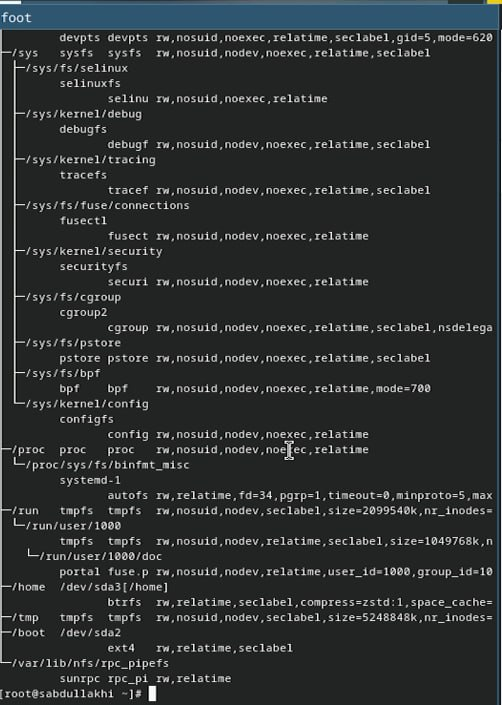{#fig:001 width=70%}

## Основные Настройки

- Указать имя и тип ОС
- Указать объём памяти больши чем 2048
- Создать виртуальной жёстктй диск (80 гб)

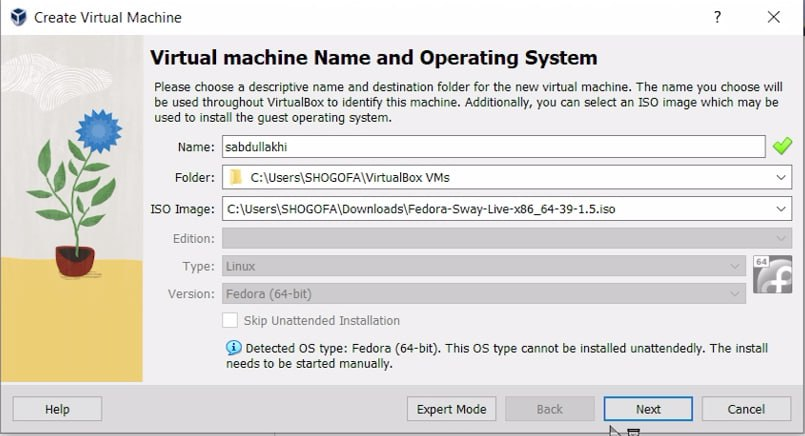{#fig:001 width=70%}
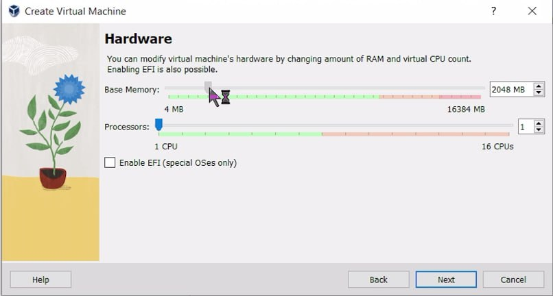{#fig:001 width=70%}
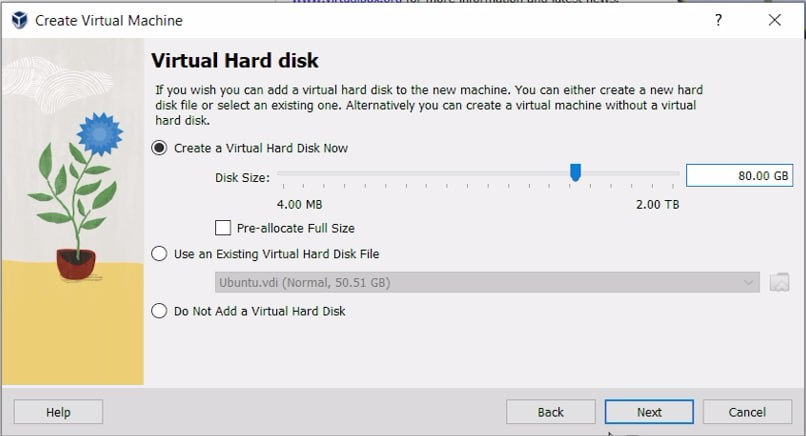{#fig:001 width=70%}

## Запуск Виртуальной машины

- Выбраем русский язык
- Проверяем возможность установки и устанавливаем

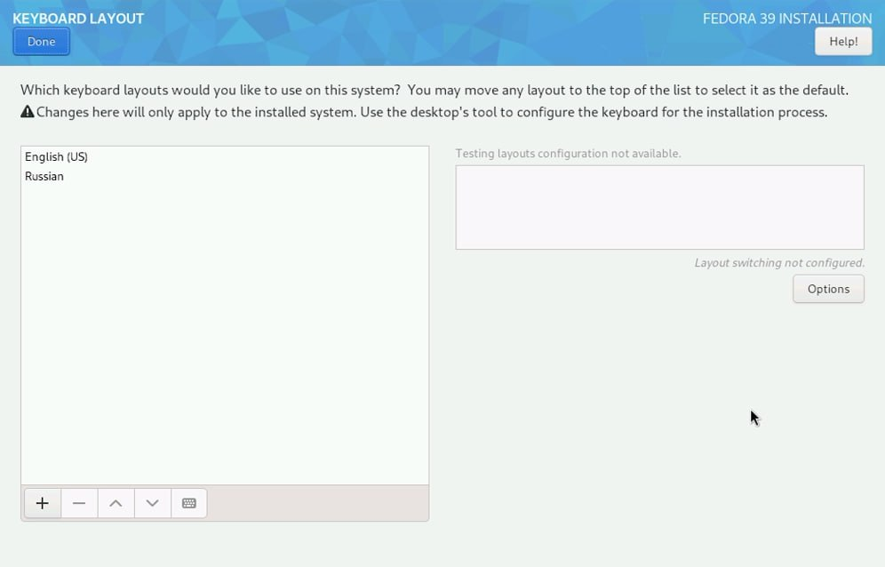{#fig:001 width=70%}

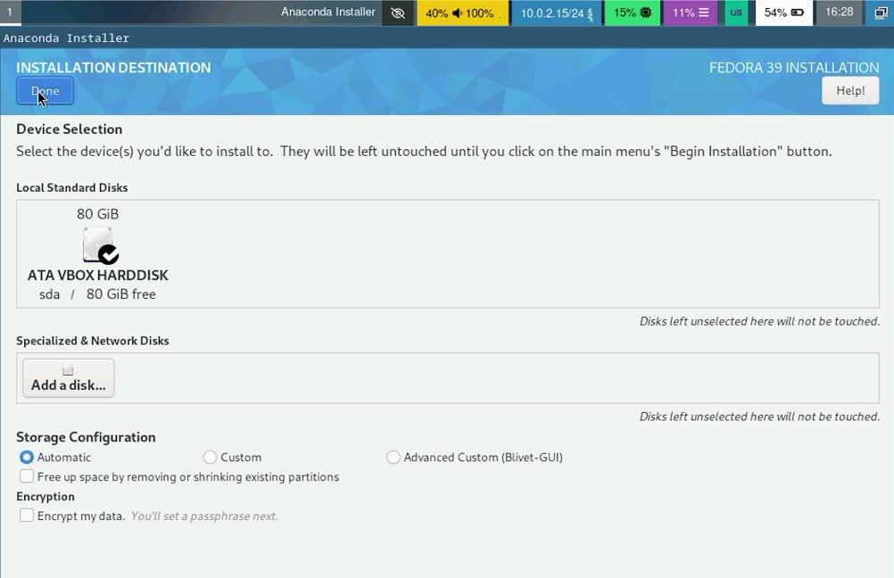{#fig:001 width=70%}

## Создание пользователя

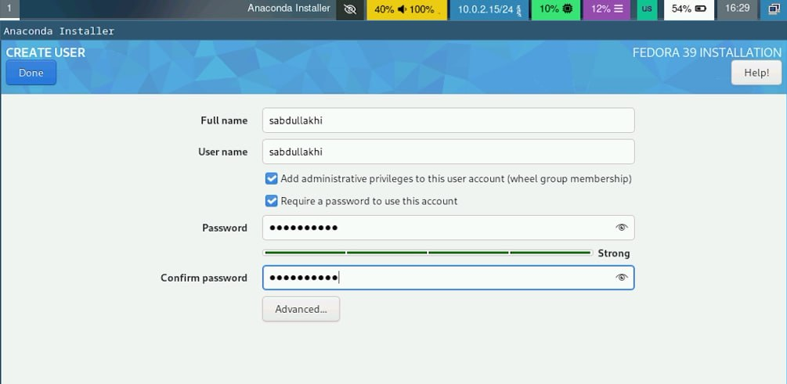{#fig:001 width=70%}

## Удаление память диска

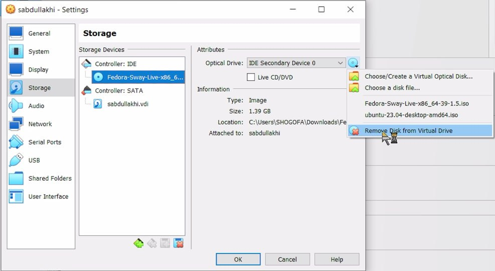{#fig:001 width=70%}

## выполнение Домашние Задания в терминале

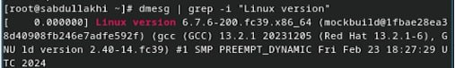{#fig:001 width=70%}
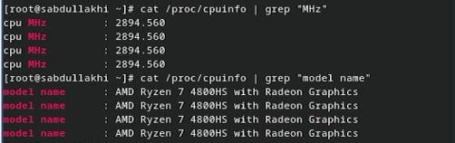{#fig:001 width=70%}
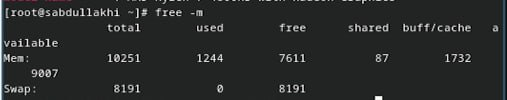{#fig:001 width=70%}
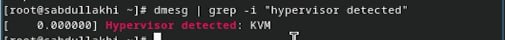{#fig:001 width=70%}
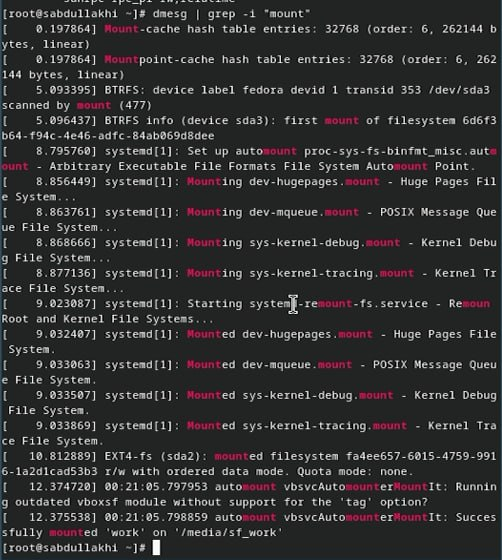{#fig:001 width=70%}
{#fig:001 width=70%}

## Вывод

- В ходе работы были приобретены практические навыки установки виртуальной машины и операционной системы на виртуальную машину, а также настройки минимально необходимых для дальнейшей работы сервисов.

##
Спасибо за внимание!
