---ввв
## Front matter
title: "Шаблон отчёта по лабораторной работе 1"
subtitle: " Установка и конфигурация операционной системы на виртуальную машину"
author: "Абдуллахи Шугофа"

## Generic otions
lang: ru-RU
toc-title: "Содержание"

## Bibliography
bibliography: bib/cite.bib
csl: pandoc/csl/gost-r-7-0-5-2008-numeric.csl

## Pdf output format
toc: true # Table of contents
toc-depth: 2
lof: true # List of figures
lot: true # List of tables
fontsize: 12pt
linestretch: 1.5
papersize: a4
documentclass: scrreprt
## I18n polyglossia
polyglossia-lang:
  name: russian
  options:
	- spelling=modern
	- babelshorthands=true
polyglossia-otherlangs:
  name: english
## I18n babel
babel-lang: russian
babel-otherlangs: english
## Fonts
mainfont: PT Serif
romanfont: PT Serif
sansfont: PT Sans
monofont: PT Mono
mainfontoptions: Ligatures=TeX
romanfontoptions: Ligatures=TeX
sansfontoptions: Ligatures=TeX,Scale=MatchLowercase
monofontoptions: Scale=MatchLowercase,Scale=0.9
## Biblatex
biblatex: true
biblio-style: "gost-numeric"
biblatexoptions:
  - parentracker=true
  - backend=biber
  - hyperref=auto
  - language=auto
  - autolang=other*
  - citestyle=gost-numeric
## Pandoc-crossref LaTeX customization
figureTitle: "Рис."
tableTitle: "Таблица"
listingTitle: "Листинг"
lofTitle: "Список иллюстраций"
lotTitle: "Список таблиц"
lolTitle: "Листинги"
## Misc options
indent: true
header-includes:
  - \usepackage{indentfirst}
  - \usepackage{float} # keep figures where there are in the text
  - \floatplacement{figure}{H} # keep figures where there are in the text
---

# **Цель работы**

Целью данной работы является приобретение практических навыко
в установки операционной системы на виртуальную машину, 
настройки минимально необходимых для дальнейшей работы сервисов.

# Выполнение лабораторной работы

## Задание 1

Нужно скачать дистрибутив Linux Fedora-35, воспользовавшись сайтом:

[link fedora](https://fedoraproject.org/spins/sway/download/index.html)

далее требуется выполнить установку Linux Fedora-35 на виртуальной машину.

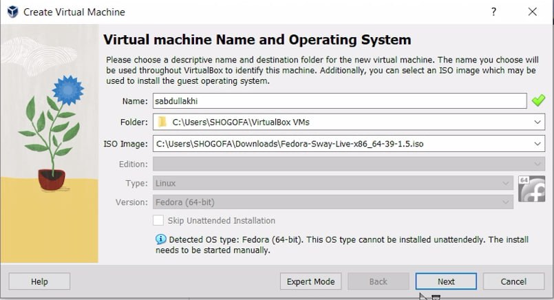{#fig:001 width=70%}

Нужно указать объём памятию

{#fig:001 width=70%}

размер виртуального жёстткого диска меняем на 80 

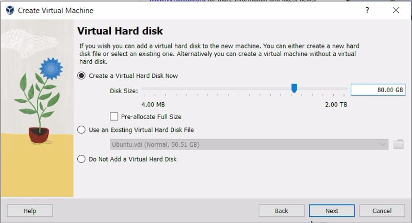{#fig:001 width=70%}

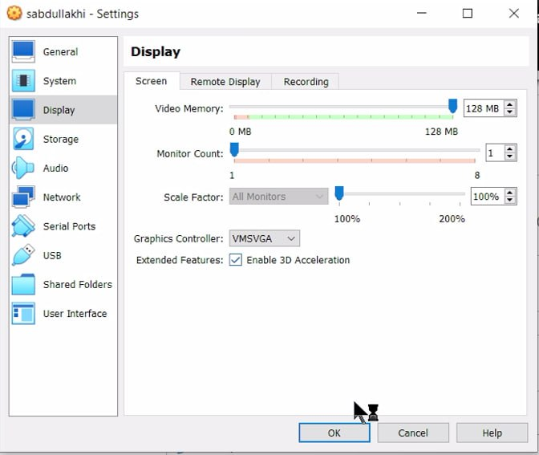{#fig:001 width=70%}

после выставления требуемых параметров нужно запустить виртуальную машину.

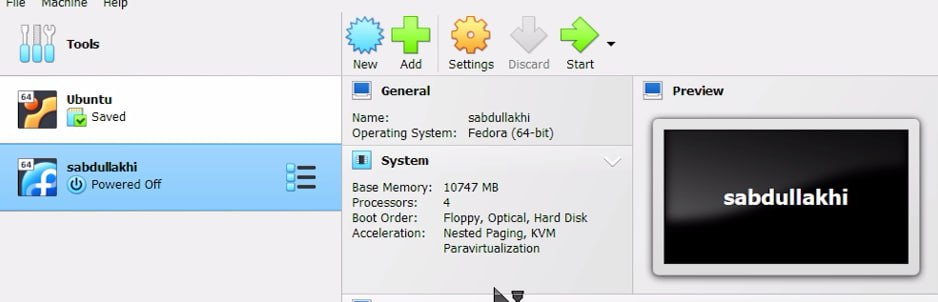{#fig:001 width=70%}

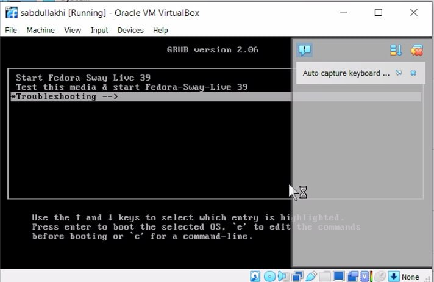{#fig:001 width=70%}

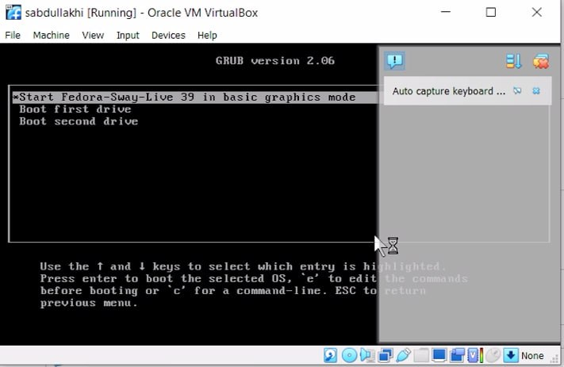{#fig:001 width=70%}

Выбираем язык для установки.

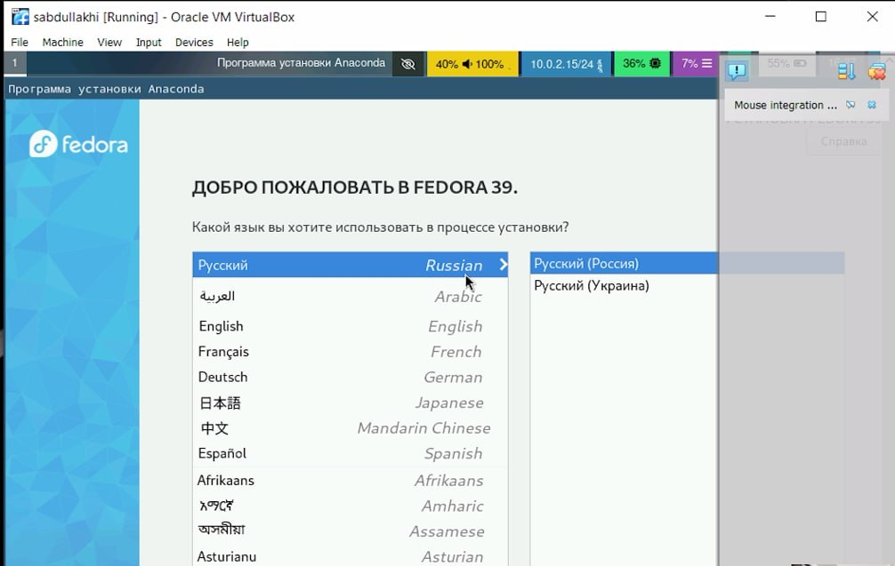{#fig:001 width=70%}

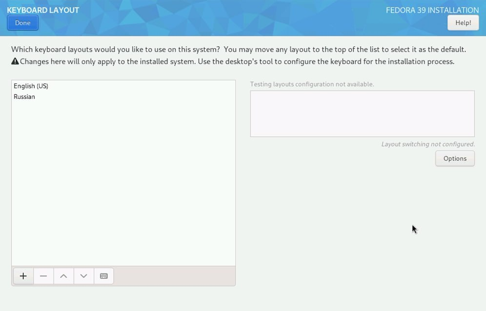{#fig:001 width=70%}

При выбор места устанувка остовляем параметры которые были выставлены автоматически.

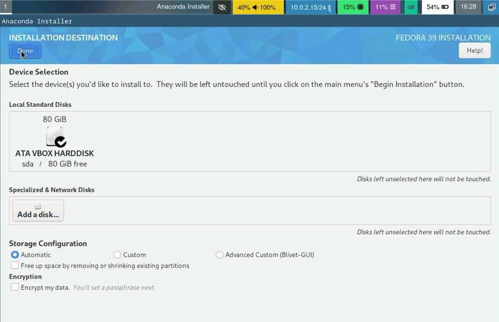{#fig:001 width=70%}

Корневая учетная запись

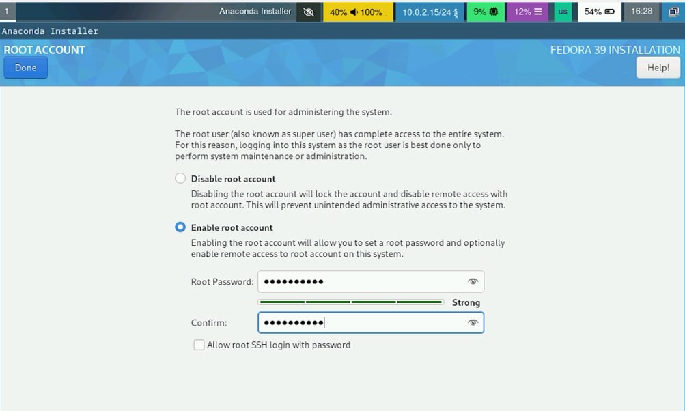{#fig:001 width=70%}

Зарегистрироваться:

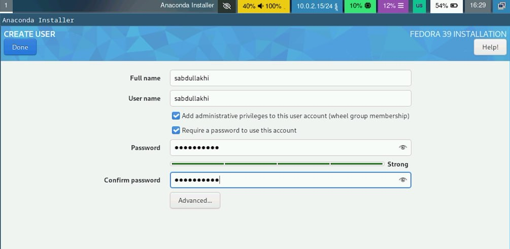{#fig:001 width=70%}

как толька система проверит возможность места установки можна будет начать процесс самой установки.
ждём и завершаем установку.

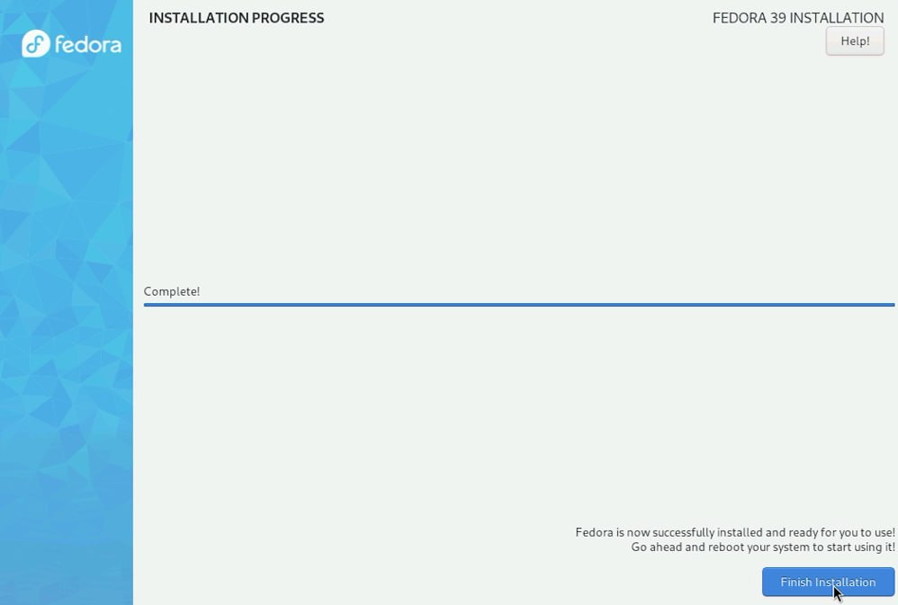{#fig:001 width=70%}

Удалить диск из виртуалбокса

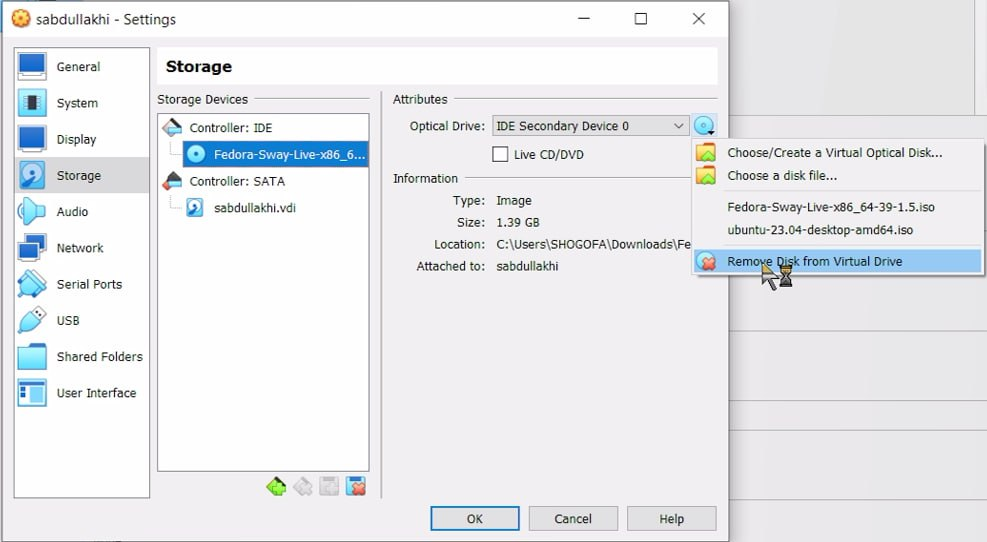{#fig:001 width=70%}

## Задание 2

### После установки

Войдите в ОС под заданной вами при установке учётной записью.
используем клавшу Win+Enter для запуска терминала.

Переключитесь на роль супер-пользователя:

 - sudo -i

обновила все пакеты с помощью этого каталога :
 - dnf -y update

Программы для удобства работы в консоли:

 - dnf -y insatll tmux

Установка программного обеспечения:

 - dnf install dnf-automatic

Запустила таймер:
 - systemctl enable --now dnf-automatic.timer

### Отключение SELinux

в этом курсе мы не будем ассматривать работу с системой безопасности SELinux.
Поэтому отключим его.
В файле /etc/selinux/config заменила значение

SELINUX=enforcing

на значение

SELINUX=permissive

после этого перезагрузила машину с помощью reboot.

### Установка драйверов для VirtualBox

вошла в операционнюу систему потом открыла терминал ( Win+Enter )
 а запустила мультиплексор tmux:

 - tmux
Переключилась на роль супер-пользователя:
 - sudo -i
Установите средства разработки:

dnf -y group install "Development Tools"

Установите пакет DKMS:

 - dnf -y install dkms

В меню виртуальной машины подключила образ диска дополнений гостевой ОС.

Подмонтируйте диск:

 - mount /dev/sr0 /media

Установите драйвера:

 - /media/VBoxLinuxAdditions.run

Перегрузите виртуальную машину:

 - reboot

### Настройка раскладки клавиатуры
вошла d операционнюу систему потом открыла терминал ( Win+Enter ) 

а запустила мультиплексор tmux:

 - tmux

создала конфигурационный файл

 - touch ~/.config/sway/config.d/95-system-keyboard-config.conf

Переключитесь на роль супер-пользователя:

 - sudo -i

Отредактируйте конфигурационный файл
 /etc/X11/xorg.conf.d/00-keyboard.conf:
через mc тоже можно войти в этот файл.

Section "InputClass"
        Identifier "system-keyboard"
        MatchIsKeyboard "on"
        Option "XkbLayout" "us,ru"
        Option "XkbVariant" ",winkeys"
        Option "XkbOptions" "grp:rctrl_toggle,compose:ralt,terminate:ctrl_alt_bksp"
EndSection

Я преобразовала и ностроила клавитуру для конвертации языков.
А после этого перегрузила машину с помощью reboot.

### Установка имени пользователя и названия хоста

Я при установки машины задала имя и password, и только здесь установила имя хоста и потом проверьла что имя хоста верно сделала
и использивалв эти команды
 - hostnamectl set-hostname username
 - hostnamectl

### Подключение общей папки
 в этом разделе я внутри виртуальной машина добавила своего ользователя в группу vboxsf 

 - gpasswd -a username vboxsf

потом в хостовой системе подключите разделяемую папку:

 - vboxmanage sharedfolder add "$(id -un)_os-intro" --name=work --hostpath=work --automount
 
А после	этого перегрузила машину с помощью reboot.

### Установка программного обеспечения для создания документации

Я открыла терминал с win+enter и напсала tmux чтобы Запустить в терминальный мультиплексор 
 и Переключилась на роль супер-пользователя: sudo -i

1 Работа с языком разметки Markdown

Установка с помощью менеджера пакетов:

 - dnf -y install pandoc

2 Установим дистрибутив TeXlive:

 - dnf -y install texlive-scheme-full

# **Домашнее задание**

- Версию ядра можно посмотреть комондой dmesg | grep -i "linux version"

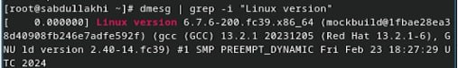{#fig:001 width=70%}

- Частота процессора можно посмотреть комондой cat/proc/cpuinfo | grep "MHz
"
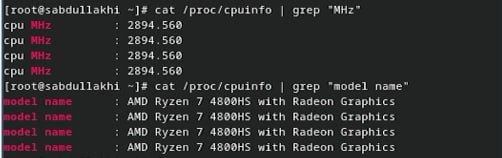{#fig:001 width=70%}

- Модель процессора можно посмотреть комондой cat/proc/cpuinfo | grep "model name"

- Объём доступной оперативной памяти (Memory available) можно посмотреть комондой free -m

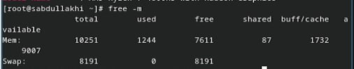{#fig:001 width=70%}

- Тип обнаруженного гипервизора можно посмотреть комондой dmesg | grep -i "hypervisor detected"

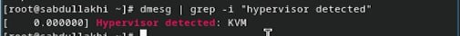{#fig:001 width=70%}

- Тип файловой системы корневого раздела можно посмотреть комондой findmnt

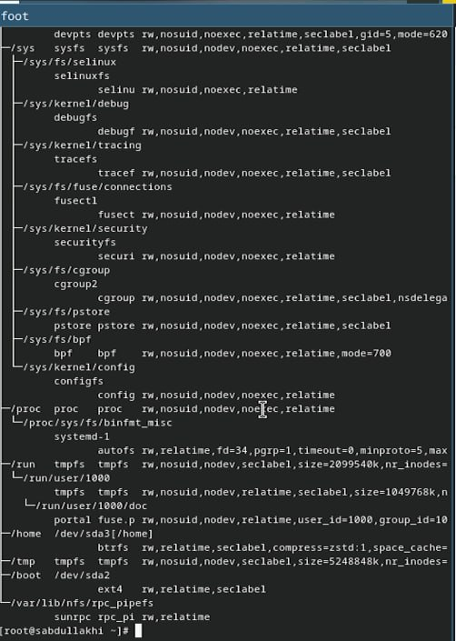{#fig:001 width=70%}

- Последовательность монтирования файловых систем  можно посмотреть комондой dmesg | grep -i "mount"

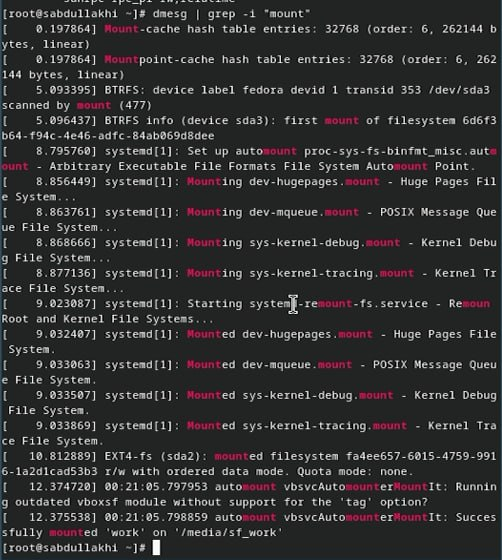{#fig:001 width=70%}
# Выводы

Здесь кратко описываются итоги проделанной работы.

# Список литературы{.unnumbered}

::: {#refs}
:::
