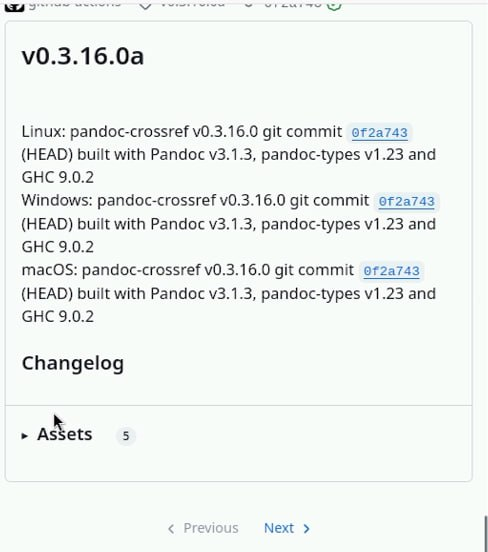
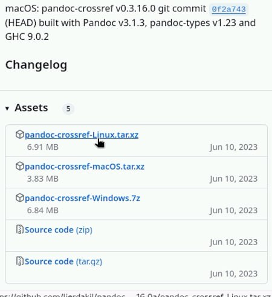
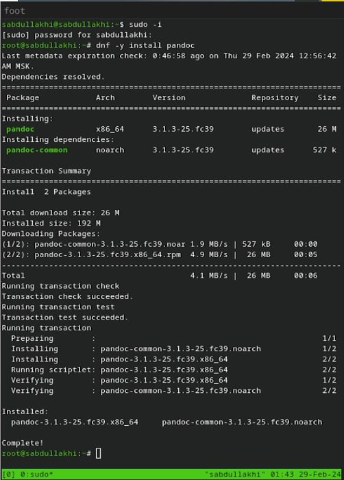
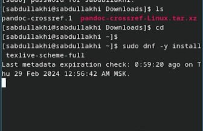
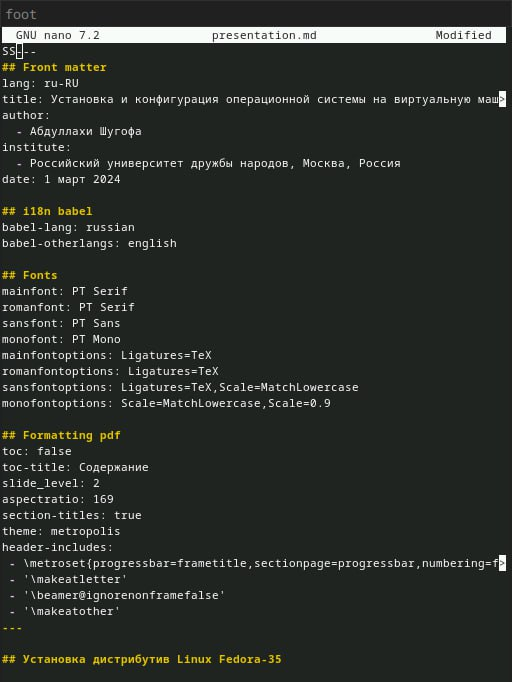
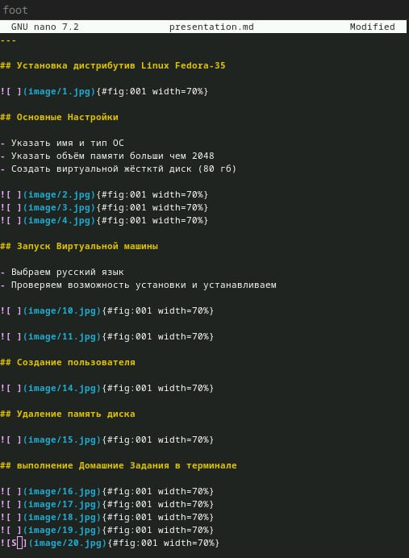
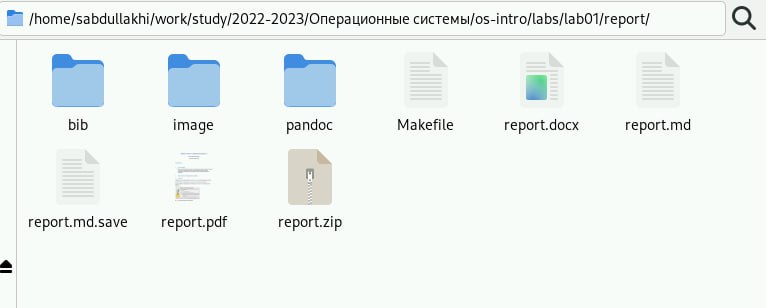
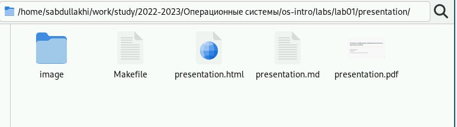
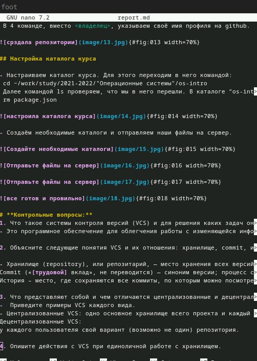
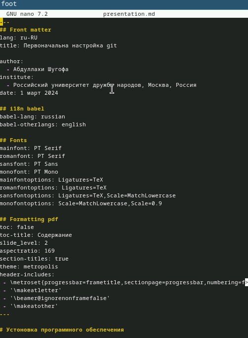

---
## Front matter
lang: ru-RU
title: Markdown

author:
  - Абдуллахи Шугофа
institute:
  - Российский университет дружбы народов, Москва, Россия
date: 2 март 2024

## i18n babel
babel-lang: russian
babel-otherlangs: english

## Fonts
mainfont: PT Serif
romanfont: PT Serif
sansfont: PT Sans
monofont: PT Mono
mainfontoptions: Ligatures=TeX
romanfontoptions: Ligatures=TeX
sansfontoptions: Ligatures=TeX,Scale=MatchLowercase
monofontoptions: Scale=MatchLowercase,Scale=0.9

## Formatting pdf
toc: false
toc-title: Содержание
slide_level: 2
aspectratio: 169
section-titles: true
theme: metropolis
header-includes:
 - \metroset{progressbar=frametitle,sectionpage=progressbar,numbering=fraction}
 - '\makeatletter'
 - '\beamer@ignorenonframefalse'
 - '\makeatother'
---

# Цель работы

Научиться оформлять отчёты с помощью легковесного языка разметки Markdown.

# Задание

- Сделайте отчёт по предыдущей лабораторной работе в формате Markdown.
- В качестве отчёта просьба предоставить отчёты в 3 форматах: pdf, docx и md (в архиве,
поскольку он должен содержать скриншоты, Makefile и т.д.)

## Выполнение  лабораторной работы

Для оброботки файлов в формате Markdown скачаем Pandoc, pandoc-crossref

{#fig:001 width=70%}

{#fig:001 width=70%}

#
- следующие шагом устанавлеваем pandoc

- команды для установки:
 - sudo dnf install pandoc

{#fig:001 width=70%}

 - sudo dnf install texlive-scheme-full

{#fig:001 width=70%}

### лабораторной работы №: 1,  №: 2 в Markdown

- я сделала отчёт для лаб номер 1 и 2 в Markdown , и потом изменили в формате dox, pdf , zip
- и тоже самая сделала презентатцию в Markdown , и потом изменили в формате html , pdf
 - мы можем изменить файл Маrkdown в формате pdf,html, dox с помощью команды make или :
   - pandoc lab_report.md -o lab_report.dox

{#fig:001 width=70%}

{#fig:001 width=70%}

{#fig:001 width=70%}

{#fig:001 width=70%}

{#fig:001 width=70%}

{#fig:001 width=70%}

# Выводы

В ходе выполнения лабораторной работы мы научились оформлять отчёты с помощью легковесного языка Markdown.
# 
Спасибо за внимание!
