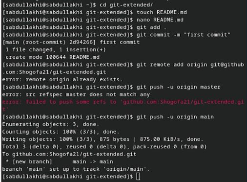

---
## Front matter
lang: ru-RU
title: Продвинутое использование git

author:
  - Абдуллахи Шугофа
institute:
  - Российский университет дружбы народов, Москва, Россия
date: 9 март 2024

## i18n babel
babel-lang: russian
babel-otherlangs: english

## Fonts
mainfont: PT Serif
romanfont: PT Serif
sansfont: PT Sans
monofont: PT Mono
mainfontoptions: Ligatures=TeX
romanfontoptions: Ligatures=TeX
sansfontoptions: Ligatures=TeX,Scale=MatchLowercase
monofontoptions: Scale=MatchLowercase,Scale=0.9

## Formatting pdf
toc: false
toc-title: Содержание
slide_level: 2
aspectratio: 169
section-titles: true
theme: metropolis
header-includes:
 - \metroset{progressbar=frametitle,sectionpage=progressbar,numbering=fraction}
 - '\makeatletter'
 - '\beamer@ignorenonframefalse'
 - '\makeatother'
---

## Установка программного обеспечения

- Установка git-flow
- Установка Node.js
- Настройка Node.js

{#fig:001 width=70%}

## 
{#fig:002 width=70%}

##
{#fig:003 width=70%}
##
{#fig:004 width=70%}

## Общепринятые коммиты

1. commitizen
2. standard-changelog

{#fig:007 width=70%}

## Конфигурация общепринятых коммитов

- Конфигурация для пакетов Node.js

{#fig:0012 width=70%}
##
{#fig:010 width=70%}

- Делаем первый коммит и выкладываем на github:

{#fig:011 width=70%}

## Конфигурация для пакетов Node.js

{#fig:012 width=70%}

## Сконфигурим формат коммитов. Для этого добавим в файл package.json 

{#fig:013 width=70%}

##
- Добавим новые файлы:
- Выполним коммит:
- Отправим на github:

##
{#fig:014 width=70%}

## Отправим на github:
- Отправим на github:
- Префикс для ярлыков установим в v.
- Проверьте, что Вы на ветке develop:
- Загрузите весь репозиторий в хранилище:
- Загрузите весь репозиторий в хранилище: 

## Отправим на github фото:

{#fig:015 width=70%}

##
- Создадим релиз с версией 1.0.0 :
  -  standard-changelog --first-release

- Добавим журнал изменений в индекс : 
  - git add CHANGELOG.md
  - git commit -am 'chore(site): add changelog'
- зальём релизную ветку в основную ветку

  - git flow release finish 1.0.0
##

{#fig:016 width=70%}

##
- Отправим данные на github
- Создадим релиз на github. Для этого будем использовать утилиты работы с github:
 
{#fig:017 width=70%}

## Работа с репозиторием git

1. Разработка новой функциональности

   -  Создадим ветку для новой функциональности:

       - git flow feature start feature_branch

   -  Далее, продолжаем работу c git как обычно.

   -  По окончании разработки новой функциональности следующим шагом следует объединить ветку feature_branch c develop:

        - git flow feature finish feature_branch

## Создание релиза git-flow

- Создадим релиз с версией 1.2.3:

  - git flow release start 1.2.3

- Обновите номер версии в файле package.json. Установите её в 1.2.3.

- Создадим журнал изменений

  - standard-changelog

- Добавим журнал изменений в индекс

  - git add CHANGELOG.md
  - git commit -am 'chore(site): update changelog'

- Зальём релизную ветку в основную ветку

  - git flow release finish 1.2.3

## Создание релиза git-flow фото:

{#fig:018 width=70%}

## Отправим данные на github
- git push --all
- git push --tags

  - Создадим релиз на github с комментарием из журнала изменений:
     - gh release create v1.2.3 -F CHANGELOG.md 
 
##
Спасибо за внимание!
