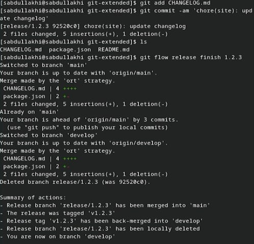

---
## Front matter
title: "Шаблон отчёта по лабораторной работе №4"
subtitle: "Продвинутое использование git"
author: "Абдуллахи Шугофа"

## Generic otions
lang: ru-RU
toc-title: "Содержание"

## Bibliography
bibliography: bib/cite.bib
csl: pandoc/csl/gost-r-7-0-5-2008-numeric.csl

## Pdf output format
toc: true # Table of contents
toc-depth: 2
lof: true # List of figures
lot: true # List of tables
fontsize: 12pt
linestretch: 1.5
papersize: a4
documentclass: scrreprt
## I18n polyglossia
polyglossia-lang:
  name: russian
  options:
	- spelling=modern
	- babelshorthands=true
polyglossia-otherlangs:
  name: english
## I18n babel
babel-lang: russian
babel-otherlangs: english
## Fonts
mainfont: PT Serif
romanfont: PT Serif
sansfont: PT Sans
monofont: PT Mono
mainfontoptions: Ligatures=TeX
romanfontoptions: Ligatures=TeX
sansfontoptions: Ligatures=TeX,Scale=MatchLowercase
monofontoptions: Scale=MatchLowercase,Scale=0.9
## Biblatex
biblatex: true
biblio-style: "gost-numeric"
biblatexoptions:
  - parentracker=true
  - backend=biber
  - hyperref=auto
  - language=auto
  - autolang=other*
  - citestyle=gost-numeric
## Pandoc-crossref LaTeX customization
figureTitle: "Рис."
tableTitle: "Таблица"
listingTitle: "Листинг"
lofTitle: "Список иллюстраций"
lotTitle: "Список таблиц"
lolTitle: "Листинги"
## Misc options
indent: true
header-includes:
  - \usepackage{indentfirst}
  - \usepackage{float} # keep figures where there are in the text
  - \floatplacement{figure}{H} # keep figures where there are in the text
---

# Цель работы

- Получение навыков правильной работы с репозиториями git.

# Задание

- Выполнить работу для тестового репозитория.
- Преобразовать рабочий репозиторий в репозиторий с git-flow и conventional commits.
 
# Выполнение лабораторной работы

## Установка программного обеспечения

### Установка git-flow
- Linux
 - fedora 
  - Установка из коллекции репозиториев Copr (https://copr.fedorainfracloud.org/coprs/elegos/gitflow/):

-  Enable the copr repository

-  Install gitflow

{#fig:001 width=70%}

#### Установка Node.js

{#fig:002 width=70%}

 - Чтобы install apt-get install pnpm, надо установим **apt** с помощью зтого камонда : dnf install apt 

{#fig:003 width=70%}

{#fig:004 width=70%}

### Настройка Node.js

- Для работы с Node.js добавим каталог с исполняемыми файлами, устанавливаемыми yarn, в переменную PATH.

{#fig:005 width=70%}

- Запустите:
- Перелогиньтесь, или выполним:

{#fig:006 width=70%}

### Общепринятые коммиты

1. commitizen 

 - Данная программа используется для помощи в форматировании коммитов.

{#fig:007 width=70%}

 - При этом устанавливается скрипт git-cz, который мы и будем использовать для коммитов.

2. standard-changelog

 - Данная программа используется для помощи в создании логов.

{#fig:008 width=70%}

3. Практический сценарий использования git

   1. Подключение репозитория к github

     - Создайте репозиторий на GitHub. Для примера назовём его git-extended.

{#fig:009 width=70%} 

{#fig:010 width=70%} 

     - Делаем первый коммит и выкладываем на github:

 1.  сначала мы  входим в файл git-extended, потом саздадим файл README.md, открываем READMED.md с помощью nano и напишим там README.md, после этого начинаем коммит на github

{#fig:011 width=70%}

 2. Конфигурация общепринятых коммитов

   -  Конфигурация для пакетов Node.js 

{#fig:012 width=70%}

   - Сконфигурим формат коммитов. Для этого добавим в файл package.json команду для формирования коммитов:

{#fig:013 width=70%}

   - Добавим новые файлы и Выполним коммит и Отправим на github:

{#fig:014 width=70%}

 3. Конфигурация git-flow

   - Инициализируем git-flow и Префикс для ярлыков установим в v.
 
{#fig:015 width=70%}

   - Проверьте, что Вы на ветке develop:
   - Загрузите весь репозиторий в хранилище:
 
{#fig:017 width=70%}

   - Установите внешнюю ветку как вышестоящую для этой ветки

{#fig:018 width=70%}

   - Создадим релиз с версией 1.0.0

{#fig:019 width=70%}
 
   - Создадим журнал изменений
 
{#fig:020 width=70%}

   - Добавим журнал изменений в индекс
 
{#fig:021 width=70%}

{#fig:022 width=70%}

{#fig:023 width=70%}

   - Зальём релизную ветку в основную ветку

{#fig:024 width=70%}

   - Отправим данные на github 

{#fig:025 width=70%} 

   - Создадим релиз на github. Для этого будем использовать утилиты работы с github:

{#fig:026 width=70%}

2. Работа с репозиторием git

  1. Разработка новой функциональности

     - Создадим ветку для новой функциональности: 

{#fig:027 width=70%}

{#fig:028 width=70%}

  2. Создание релиза git-flow

{#fig:029 width=70%}

{#fig:030 width=70%}
 
    - Создадим журнал изменений

{#fig:031 width=70%}
 
    - Добавим журнал изменений в индекс
    - Зальём релизную ветку в основную ветку
{#fig:032 width=70%}

{#fig:033 width=70%}

   - Отправим данные на github
   - Создадим релиз на github с комментарием из журнала изменений:

{#fig:034 width=70%}

# Выводы

Получение навыков правильной работы с репозиториями git.

