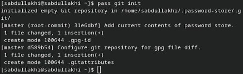

---
## Front matter
lang: ru-RU
title: Настройка рабочей среды.

author:
  - Абдуллахи Шугофа
institute:
  - Российский университет дружбы народов, Москва, Россия
date: 16 март 2024

## i18n babel
babel-lang: russian
babel-otherlangs: english

## Fonts
mainfont: PT Serif
romanfont: PT Serif
sansfont: PT Sans
monofont: PT Mono
mainfontoptions: Ligatures=TeX
romanfontoptions: Ligatures=TeX
sansfontoptions: Ligatures=TeX,Scale=MatchLowercase
monofontoptions: Scale=MatchLowercase,Scale=0.9

## Formatting pdf
toc: false
toc-title: Содержание
slide_level: 2
aspectratio: 169
section-titles: true
theme: metropolis
header-includes:
 - \metroset{progressbar=frametitle,sectionpage=progressbar,numbering=fraction}
 - '\makeatletter'
 - '\beamer@ignorenonframefalse'
 - '\makeatother'
---

## Выполнение лабораторной работы
1. Менеджер паролей pass
 - fedora 
   - pass
   - gopass

{#fig:001 width=30%}       {#fig:002 width=30%}

## Настройка
1. Инициализация хранилища

{#fig:003 width=70%}

## Синхронизация с git
- Создадим структуру git:

{#fig:004 width=50%}

- Также можно задать адрес репозитория на хостинге (репозиторий необходимо предварительно создать):

 {#fig:005 width=50%}

- Для синхронизации выполняется следующая команда:
     pass git pull
     pass git push

## Прямые изменения

- Внесение изменений вручную

 {#fig:008 width=50%}

- Проверила статус синхронизации модно командой
     pass git status

## Настройка интерфейса с броузером

- fedora

 {#fig:0010 width=70%}

## Сохранение пароля
1. Добавила новый пароль
2. Отобразила пароль для указанного имени файла
3. Заменила существующий пароль

{#fig:0012 width=70%}

## Дополнительное программное обеспечение
- Установите дополнительное программное обеспечение

{#fig:0013 width=50%}

## Установила шрифты:
  
    sudo dnf copr enable peterwu/iosevka
    sudo dnf search iosevka
    sudo dnf install iosevka-fonts iosevka-aile-fonts iosevka-curly-fonts iosevka-slab-fonts iosevka-etoile-fonts iosevka-term-fonts

## Установка

1. Установка бинарного файла.
2. Создание собственного репозитория с помощью утилит
3. Инициализируйте chezmoi с вашим репозиторием dotfiles

## фото установка

{#fig:0015 width=50%}

{#fig:0016 width=50%}

## Использование chezmoi на нескольких машинах

- я инициализируила chezmoi c репозиторием dotfiles

{#fig:0018 width=70%}

## Проверьте изменения внесёт chezmoi в домашний каталог
- chezmoi diff
- chezmoi apply -v

{#fig:0019 width=70%}

## Ежедневные операции c chezmoi

- Можно извлечь изменения из репозитория и применить их одной командой:

{#fig:022 width=50%}
 
- Извлеките последние изменения из своего репозитория и посмотрите, что изменится, фактически не применяя изменения
  - chezmoi git pull -- --autostash --rebase && chezmoi diff

## Автоматически фиксируйте и отправляйте изменения в репозиторий

- Чтобы включить её, добавьте в файл конфигурации ~/.config/chezmoi/chezmoi.toml следующее:

{#fig:025 width=30%}

##
Спасибо за внимание!

