---
## Front matter
title: "Шаблон отчёта по лабораторной работе №5"
subtitle: "Настройка рабочей среды"
author: "Абдуллахи Шугофа"

## Generic otions
lang: ru-RU
toc-title: "Содержание"

## Bibliography
bibliography: bib/cite.bib
csl: pandoc/csl/gost-r-7-0-5-2008-numeric.csl

## Pdf output format
toc: true # Table of contents
toc-depth: 2
lof: true # List of figures
lot: true # List of tables
fontsize: 12pt
linestretch: 1.5
papersize: a4
documentclass: scrreprt
## I18n polyglossia
polyglossia-lang:
  name: russian
  options:
	- spelling=modern
	- babelshorthands=true
polyglossia-otherlangs:
  name: english
## I18n babel
babel-lang: russian
babel-otherlangs: english
## Fonts
mainfont: PT Serif
romanfont: PT Serif
sansfont: PT Sans
monofont: PT Mono
mainfontoptions: Ligatures=TeX
romanfontoptions: Ligatures=TeX
sansfontoptions: Ligatures=TeX,Scale=MatchLowercase
monofontoptions: Scale=MatchLowercase,Scale=0.9
## Biblatex
biblatex: true
biblio-style: "gost-numeric"
biblatexoptions:
  - parentracker=true
  - backend=biber
  - hyperref=auto
  - language=auto
  - autolang=other*
  - citestyle=gost-numeric
## Pandoc-crossref LaTeX customization
figureTitle: "Рис."
tableTitle: "Таблица"
listingTitle: "Листинг"
lofTitle: "Список иллюстраций"
lotTitle: "Список таблиц"
lolTitle: "Листинги"
## Misc options
indent: true
header-includes:
  - \usepackage{indentfirst}
  - \usepackage{float} # keep figures where there are in the text
  - \floatplacement{figure}{H} # keep figures where there are in the text
---

# Выполнение лабораторной работы
## Настройка рабочей среды
1. Установка

  - pass

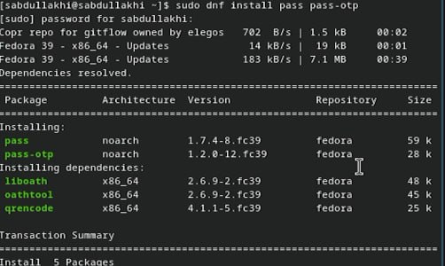{#fig:001 width=70%}

  - gopass

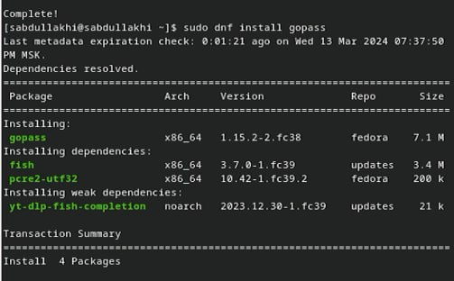{#fig:002 width=70%}

2. Настройка
 1. Ключи GPG
 в лабораторной работе № 2 я уже создала ключи GPG. 

 2. Инициализация хранилища
  - Инициализируем хранилище:

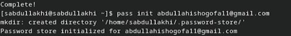{#fig:003 width=70%}

3. Синхронизация с git
  - Создадим структуру git:

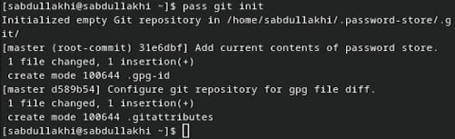{#fig:004 width=70%}

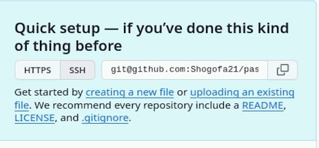{#fig:005 width=70%}

  - зададим адрес репозитория на хостиге

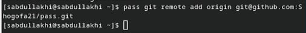{#fig:006 width=70%}
 
  - Для синхронизации выполняется следующая команда:

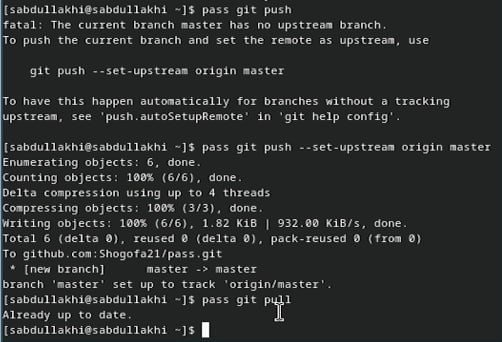{#fig:007 width=70%}
 
  1. Прямые изменения

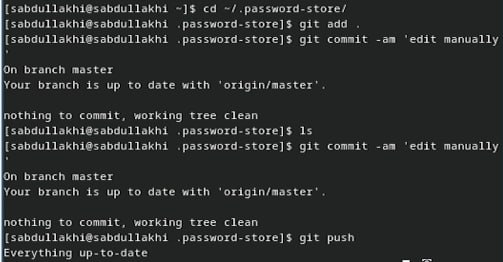{#fig:008 width=70%}

  - Проверить статус синхронизации модно командой

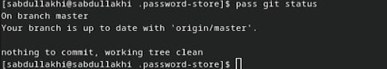{#fig:009 width=70%}

# Настройка интерфейса с броузером

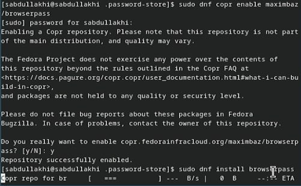{#fig:010 width=70%}

# Сохранение пароля

- Чтобы добавить новый файла сначала я создала новый файл с иминий pass.txt

{#fig:011 width=70%}

1. Добавить новый пароль
 - Отобразите пароль для указанного имени файла:
 - Замените существующий пароль:

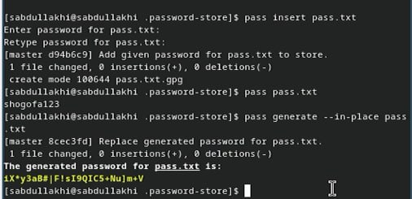{#fig:012 width=70%}
 
# Управление файлами конфигурации
## Дополнительное программное обеспечение
- Установите дополнительное программное обеспечение:

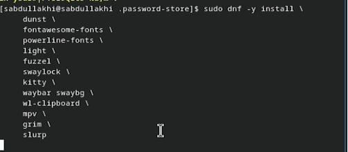{#fig:013 width=70%}

- Установка шрифты с помощью этих командов:

sudo dnf copr enable peterwu/iosevka
sudo dnf search iosevka
sudo dnf install iosevka-fonts iosevka-aile-fonts iosevka-curly-fonts iosevka-slab-fonts iosevka-etoile-fonts iosevka-term-fonts

# Установка

- Установка бинарного файла. Скрипт определяет архитектуру процессора и операционную систему и скачивает необходимый файл:

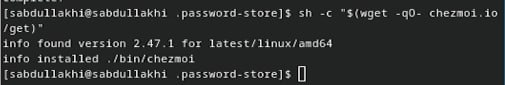{#fig:014 width=70%}

# Создание собственного репозитория с помощью утилит

- Создадим свой репозиторий для конфигурационных файлов на основе шаблона:

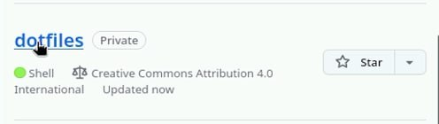{#fig:015 width=70%}

# Подключение репозитория к своей системе

- Я выполнила в терминале серию команд, чтобы настроить и инициализировать систему контроля версий для обработки файлов конфигурации (точечных файлов).  Эти шаги включают загрузку и установку инструмента «chezmoi», создание репозитория на GitHub, клонирование репозитория и инициализацию chezmoi с помощью клонированного репозитория.

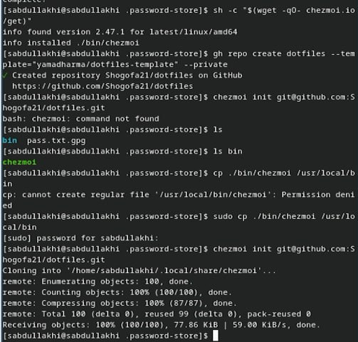{#fig:016 width=70%}

- Проверьте, какие изменения внесёт chezmoi в домашний каталог, запустив:

{#fig:017 width=70%}

# Использование chezmoi на нескольких машинах

- на Ubuntu я инициализируила chezmoi с маём репозиторием dotfiles:

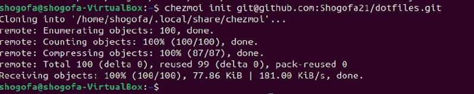{#fig:018 width=70%}

- Проверьте, какие изменения внесёт chezmoi в домашний каталог, запустив:

  - chezmoi apply -v

{#fig:019 width=70%}

- При существующем каталоге chezmoi можно получить и применить последние изменения из вашего репозитория:

  - chezmoi update -v

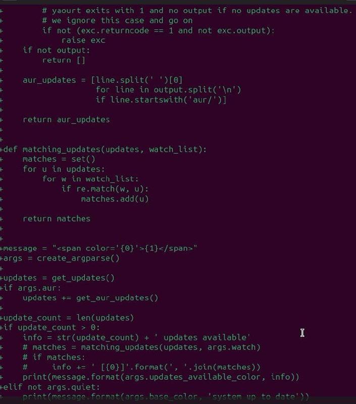{#fig:020 width=70%}

# Настройка новой машины с помощью одной команды

- я установила свои dotfiles на новый компьютер с помощью этого команды:
 - Через ssh:

{#fig:021 width=70%}

# Ежедневные операции c chezmoi
1. 
- Можно извлечь изменения из репозитория и применить их одной командой:
 - chezmoi update
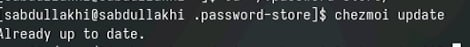{#fig:022 width=70%}

2. 
- Извлеките последние изменения из своего репозитория и посмотрите, что изменится, фактически не применяя изменения

 - chezmoi git pull -- --autostash --rebase && chezmoi diff

- Если вы довольны изменениями, вы можете применить их:

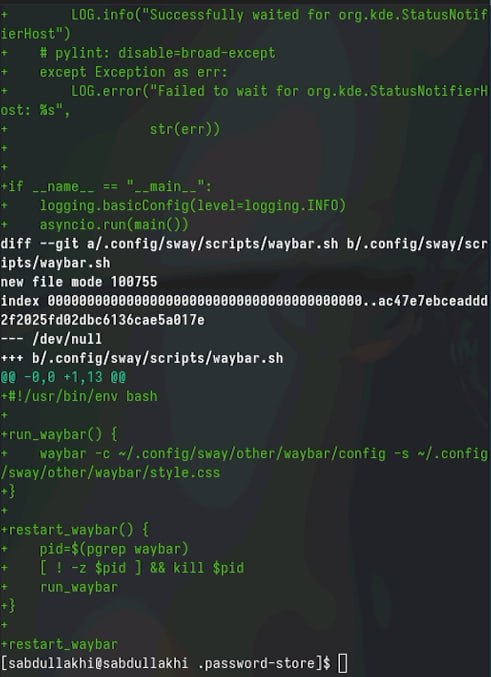{#fig:023 width=70%}

3. 
- Автоматически фиксируйте и отправляйте изменения в репозиторий
  - Чтобы включить её, добавьте в файл конфигурации ~/.config/chezmoi/chezmoi.toml следующее:

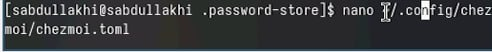{#fig:024 width=70%}

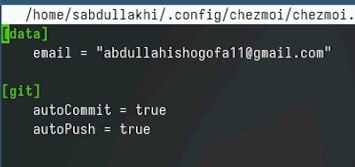{#fig:025 width=70%}

