---
## Front matter
lang: ru-RU
title: Основы интерфейса взаимодействия пользователя с системой Unix на уровне командной строки

author:
  - Абдуллахи Шугофа
institute:
  - Российский университет дружбы народов, Москва, Россия
date: 16 март 2024

## i18n babel
babel-lang: russian
babel-otherlangs: english

## Fonts
mainfont: PT Serif
romanfont: PT Serif
sansfont: PT Sans
monofont: PT Mono
mainfontoptions: Ligatures=TeX
romanfontoptions: Ligatures=TeX
sansfontoptions: Ligatures=TeX,Scale=MatchLowercase
monofontoptions: Scale=MatchLowercase,Scale=0.9

## Formatting pdf
toc: false
toc-title: Содержание
slide_level: 2
aspectratio: 169
section-titles: true
theme: metropolis
header-includes:
 - \metroset{progressbar=frametitle,sectionpage=progressbar,numbering=fraction}
 - '\makeatletter'
 - '\beamer@ignorenonframefalse'
 - '\makeatother'
---

## Команда pwd

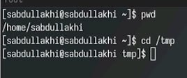{#fig:022 width=70%}

## каталог tmp

{#fig:001 width=70>

## команды ls

- мы используем ls чтобы посмотрить содержимое каталога

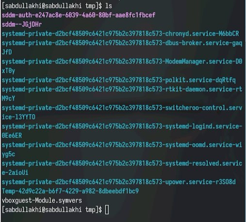{#fig:002 width=50>

## команды ls -l
- для вывести подробную информацию о файлах и каталогах:

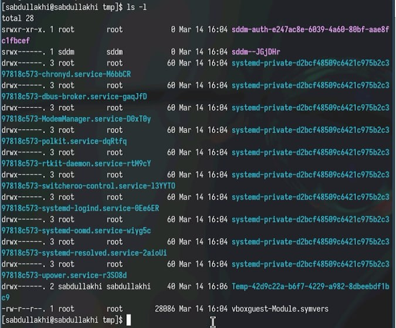{#fig:003 width=50>

## команды ls -a
чтобы отоброзить имена скрытых фаайлов используем ls -a

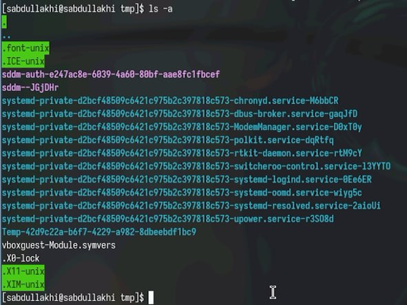{#fig:004 width=50>

## команды ls -alF

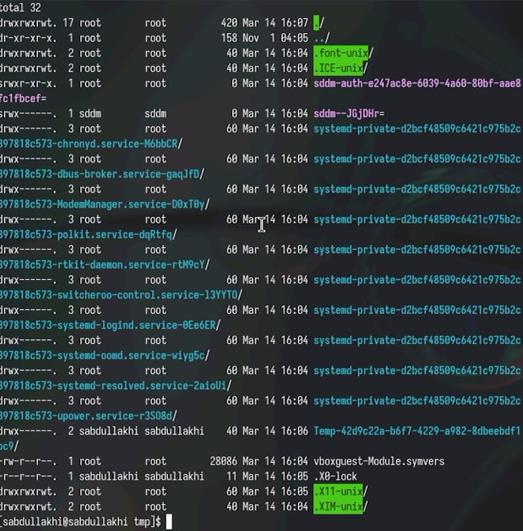{#fig:005 width=50>

## каталога с именем cron

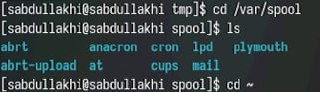{#fig:006 width=70>

## содержимое домашний каталог

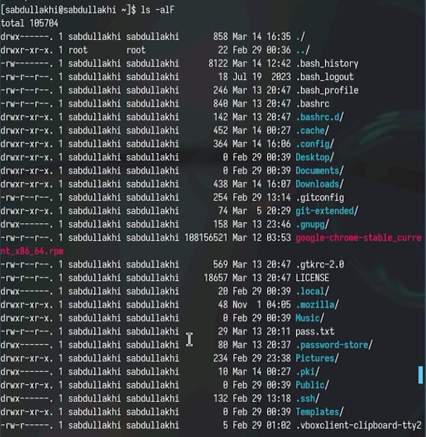{#fig:007 width=50>

## создание новый каталог newdir 

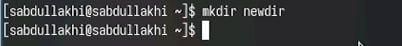{#fig:008 width=70>

## создание новый каталог с именем morefun

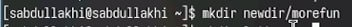{#fig:009 width=70>

##  создание и удалиние каталоги letters ,memos ,misk

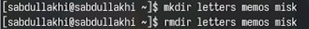{#fig:010 width=70>

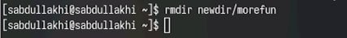{#fig:012 width=70>

## Recursive

- С помощью команды man ls выясняем, что для просмотра содержимого не только указанного каталога, но и подкаталогов нужно использовать опцию -R

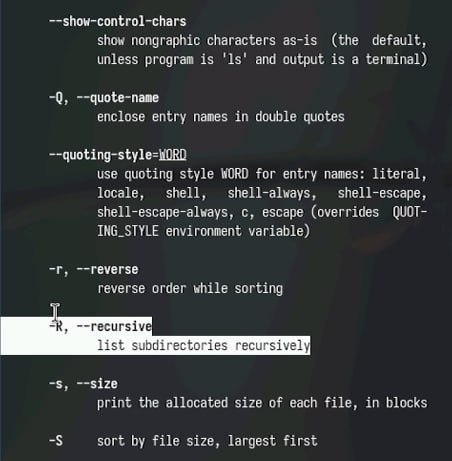{#fig:013 width=50>

## команд man cd

- команду man для просмотра описания следующих команд: cd, pwd, mkdir, rmdir, rm. 
- Команда cd используется для перемещения по файловой системы

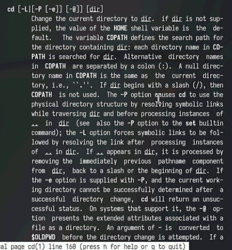{#fig:014 width=50>

## команд pwd

- Для определения абсолютного пути к текущему каталогу используется команда pwd (print working directory)

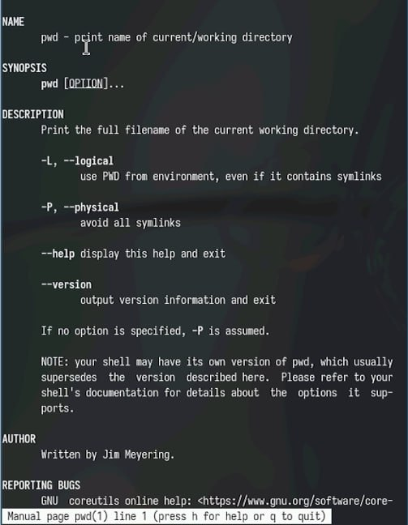{#fig:015 width=50>

## команд mkdir

- mkdir создавает котологов

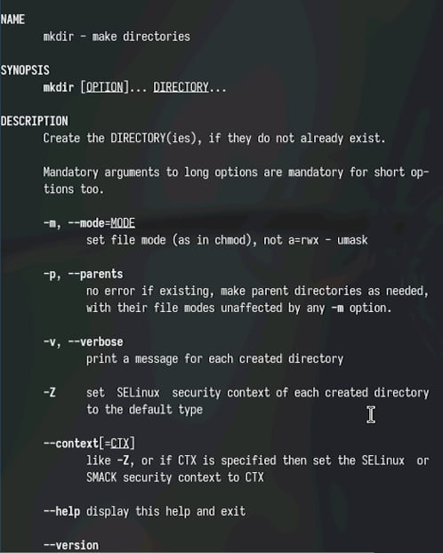{#fig:016 width=50>

## команд rmdir 

- rmdir удалит пустой каталогов

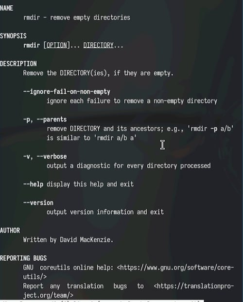{#fig:017 width=50>

## команд rm

- rm удалит файлов или каталогов

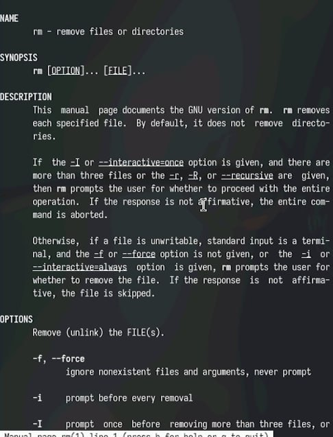{#fig:018 width=50>

## команд history

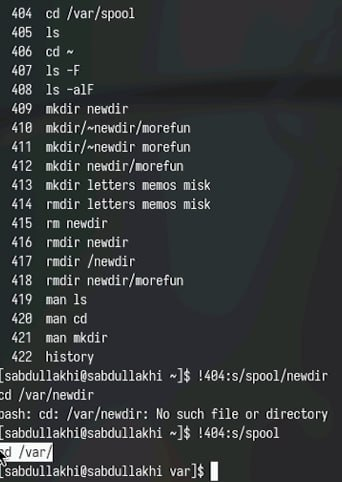{#fig:019 width=50>

## модификация

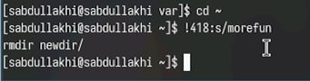{#fig:020 width=70>

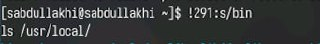{#fig:021 width=70>

##
Спасибо за внимание!

