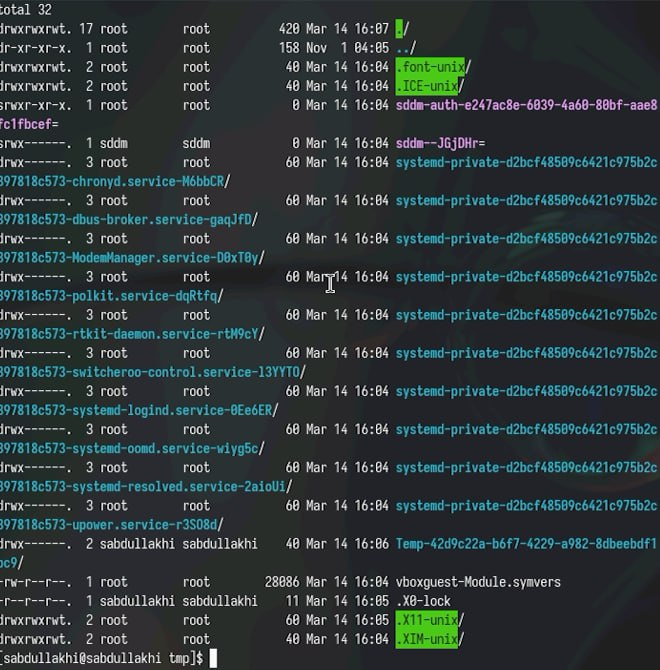

---
## Front matter
title: "Шаблон отчёта по лабораторной работе №5"
subtitle: "Простейший вариант"
author: "Абдуллахи Шугофа"

## Generic otions
lang: ru-RU
toc-title: "Содержание"

## Bibliography
bibliography: bib/cite.bib
csl: pandoc/csl/gost-r-7-0-5-2008-numeric.csl

## Pdf output format
toc: true # Table of contents
toc-depth: 2
lof: true # List of figures
lot: true # List of tables
fontsize: 12pt
linestretch: 1.5
papersize: a4
documentclass: scrreprt
## I18n polyglossia
polyglossia-lang:
  name: russian
  options:
	- spelling=modern
	- babelshorthands=true
polyglossia-otherlangs:
  name: english
## I18n babel
babel-lang: russian
babel-otherlangs: english
## Fonts
mainfont: PT Serif
romanfont: PT Serif
sansfont: PT Sans
monofont: PT Mono
mainfontoptions: Ligatures=TeX
romanfontoptions: Ligatures=TeX
sansfontoptions: Ligatures=TeX,Scale=MatchLowercase
monofontoptions: Scale=MatchLowercase,Scale=0.9
## Biblatex
biblatex: true
biblio-style: "gost-numeric"
biblatexoptions:
  - parentracker=true
  - backend=biber
  - hyperref=auto
  - language=auto
  - autolang=other*
  - citestyle=gost-numeric
## Pandoc-crossref LaTeX customization
figureTitle: "Рис."
tableTitle: "Таблица"
listingTitle: "Листинг"
lofTitle: "Список иллюстраций"
lotTitle: "Список таблиц"
lolTitle: "Листинги"
## Misc options
indent: true
header-includes:
  - \usepackage{indentfirst}
  - \usepackage{float} # keep figures where there are in the text
  - \floatplacement{figure}{H} # keep figures where there are in the text
---

# Цель работы

Приобретение практических навыков взаимодействия пользователя с системой по-
средством командной строки.

# заданиен

1. пределите полное имя вашего домашнего каталога. Далее относительно этого ката-
лога будут выполняться последующие упражнения.
2. Выполните следующие действия:
2.1. Перейдите в каталог /tmp.
2.2. Выведите на экран содержимое каталога /tmp. Для этого используйте команду ls
с различными опциями. Поясните разницу в выводимой на экран информации.
2.3. Определите, есть ли в каталоге /var/spool подкаталог с именем cron?
2.4. Перейдите в Ваш домашний каталог и выведите на экран его содержимое. Опре-
делите, кто является владельцем файлов и подкаталогов?
3. Выполните следующие действия:
3.1. В домашнем каталоге создайте новый каталог с именем newdir.
3.2. В каталоге ~/newdir создайте новый каталог с именем morefun.
3.3. В домашнем каталоге создайте одной командой три новых каталога с именами
letters, memos, misk. Затем удалите эти каталоги одной командой.
3.4. Попробуйте удалить ранее созданный каталог ~/newdir командой rm. Проверьте,
был ли каталог удалён.
3.5. Удалите каталог ~/newdir/morefun из домашнего каталога. Проверьте, был ли
каталог удалён.
4. С помощью команды man определите, какую опцию команды ls нужно использо-
вать для просмотра содержимое не только указанного каталога, но и подкаталогов,
входящих в него.
5. С помощью команды man определите набор опций команды ls, позволяющий отсорти-
ровать по времени последнего изменения выводимый список содержимого каталога
с развёрнутым описанием файлов.
6. Используйте команду man для просмотра описания следующих команд: cd, pwd, mkdir,
rmdir, rm. Поясните основные опции этих команд.
7. Используя информацию, полученную при помощи команды history, выполните мо-
дификацию и исполнение нескольких команд из буфера команд

# Выполнение лабораторной работы

1.  определила полное имя дамашнего каталога с помощью команды :
  - pwd
{#fig:022 width=70%}

2. Выполните следующие действия: 

2.1. после этого перешла в каталог /tmp с помощью команды cd

{#fig:001 width=70%}

2.2. выведим на экран содержимое каталога /tmp с помощью команды ls

- мы используем ls чтобы посмотрить содержимое каталога

{#fig:002 width=70%}

- чтобы отоброзить имена скрытых фаайлов используем ls -a 

{#fig:004 width=70%}

- для вывести подробную информацию о файлах и каталогах:

{#fig:003 width=70%}

{#fig:005 width=70%}

2.3 определила есть ли в каталоге /var/spool подкаталог с именем cron?
 для этого используем команды cd & ls

{#fig:006 width=70%}

2.4 Перешла в домашний каталог с помощью cd  и выведилана экран его содержимое. Опре-
делила, кто является владельцем файлов и подкаталогов с помошью ls -alF

{#fig:007 width=70%}

3. Выполните следующие действия:

3.1  В домашнем каталоге создала новый каталог с именем newdir с помошью mkdir

{#fig:008 width=70%}

3.2 В каталоге ~/newdir создала новый каталог с именем morefun c помошью mkdir

{#fig:009 width=70%}

3.3  В домашнем каталоге создала одной командой с помошью mkdir три новых каталога с именами
letters, memos, misk. Затем удалила эти каталоги с помошью rmdir .

{#fig:010 width=70%}

3.4 Попробила удалить ранее созданный каталог ~/newdir командой rm. Проверила ,
не был каталог удалён.

{#fig:011 width=70%}

3.5 Удалила каталог ~/newdir/morefun из домашнего каталога с помошью rmdir

{#fig:012 width=70%}

4. С помощью команды man ls выясняем, что для просмотра содержимого не только указанного каталога, но и подкаталогов нужно использовать опцию -R

{#fig:013 width=70%}

5. С помощью команды man ls мы создаем набор параметров команды, которые позволяют нам упорядочить выходной список содержимого каталога в соответствии с временем последнего изменения. Доступные альтернативы: -c -lt

6. Используйте команду man для просмотра описания следующих команд: cd, pwd, mkdir,
rmdir, rm. Поясните основные опции этих команд.

- Команда cd используется для перемещения по файловой системы

{#fig:014 width=70%}

- Для определения абсолютного пути к текущему каталогу используется команда pwd (print working directory)
 
{#fig:015 width=70%}

- mkdir создавает котологов 

{#fig:016 width=70%}

- rmdir удалит пустой каталогов
 
{#fig:017 width=70%}

- rm удалит файлов или каталогов

{#fig:018 width=70%}

7. Используя информацию, полученную при помощи команды history, выполните мо-
дификацию и исполнение нескольких команд из буфера команд

{#fig:019 width=70%}

{#fig:020 width=70%}

{#fig:021 width=70%}

# Контрольные вопросы
1. Что такое командная строка?
-  Терминал Linux предоставляет интерфейс, в котором можно вводить команды и видеть результат, напечатанный в виде текста. Можно использовать терминал для выполнения таких задач, как перемещение файлов или навигация по каталогу, без использования графического интерфейса.
2. При помощи какой команды можно определить абсолютный путь текущего каталога? Приведите пример.
-  При помощи команды pwd.
3. При помощи какой команды и каких опций можно определить только тип файлов и их имена в текущем каталоге? Приведите примеры.
-  ls -F.
4. Каким образом отобразить информацию о скрытых файлах? Приведите примеры.
-  Для того, чтобы отобразить имена скрытых файлов, необходимо использовать команду ls с опцией a.
5. При помощи каких команд можно удалить файл и каталог? Можно ли это сделать одной и той же командой? Приведите примеры.
-  rmdir и rm.
6. Каким образом можно вывести информацию о последних выполненных пользователем командах? работы?
7. Как воспользоваться историей команд для их модифицированного выполнения? Приведите примеры.
-  С помощью команды history.
8. Приведите примеры запуска нескольких команд в одной строке.
9. Дайте определение и приведите примера символов экранирования.
-  Экранирование символов — замена в тексте управляющих символов на соответствующие текстовые подстановки.
10.  Охарактеризуйте вывод информации на экран после выполнения команды ls с опцией l.
-  Чтобы вывести на экран подробную информацию о файлах и каталогах, необходимо использовать опцию l. При этом о каждом файле и каталоге будет выведена следующая информация: тип файла, право доступа, число ссылок, владелец, размер, дата последней ревизии, имя файла или каталога.
11. Что такое относительный путь к файлу? Приведите примеры использования относительного и абсолютного пути при выполнении какой-либо команды. 
- Относительный путь представляет собой путь по отношению к текущему рабочему каталогу пользователя или активных приложений.
12. Как получить информацию об интересующей вас команде? 
- При помощи команды man.
13. Какая клавиша или комбинация клавиш служит для автоматического дополнения вводимых команд?
-  Tab.

# Вывод
Практические навыки пользовательского интерфейса командной строки с системой изучались на протяжении всей лабораторной работы.

