---
## Front matter
lang: ru-RU
title: Анализ файловой структуры UNIX. Команды для работы с файлами и каталогами

author:
  - Абдуллахи Шугофа
institute:
  - Российский университет дружбы народов, Москва, Россия
date: 23 март 2024

## i18n babel
babel-lang: russian
babel-otherlangs: english

## Fonts
mainfont: PT Serif
romanfont: PT Serif
sansfont: PT Sans
monofont: PT Mono
mainfontoptions: Ligatures=TeX
romanfontoptions: Ligatures=TeX
sansfontoptions: Ligatures=TeX,Scale=MatchLowercase
monofontoptions: Scale=MatchLowercase,Scale=0.9

## Formatting pdf
toc: false
toc-title: Содержание
slide_level: 2
aspectratio: 169
section-titles: true
theme: metropolis
header-includes:
 - \metroset{progressbar=frametitle,sectionpage=progressbar,numbering=fraction}
 - '\makeatletter'
 - '\beamer@ignorenonframefalse'
 - '\makeatother'
---

## Копирование файла и изменение его название

- cd : скопировать файла
- ls : используем для посмотреть содержаемое

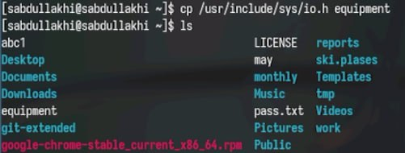{ #fig:002 width=70% }

##  создание директории 

- mkdir : Используем mkdir чтобы создать директории

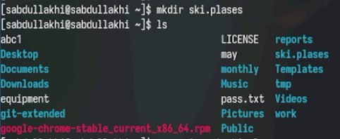{ #fig:003 width=70% }

## Перемещение Фаила

- mv : Используем mv чтобы изменить название файла или для перемещение файла

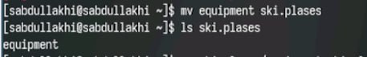{ #fig:004 width=70% }

## Изменение Название файла 

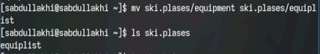{ #fig:005 width=70% }

## Создание Скопирование и Название файла

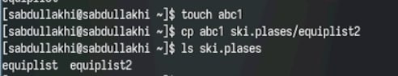{ #fig:006 width=70% }

## Создание Каталога 

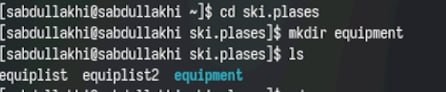{ #fig:007 width=70% }

## Перемещение Файлов в каталог

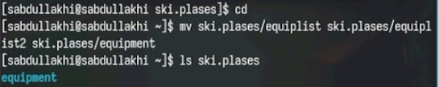{ #fig:008 width=70% }

## Создание Скопирование и Название каталога

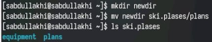{ #fig:009 width=70% }

##  Создание каталогов

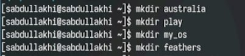{ #fig:010 width=70% }

## Определение опции команды chmod

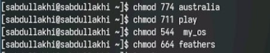{ #fig:011 width=70% }

## Посмотрение Содержаемое

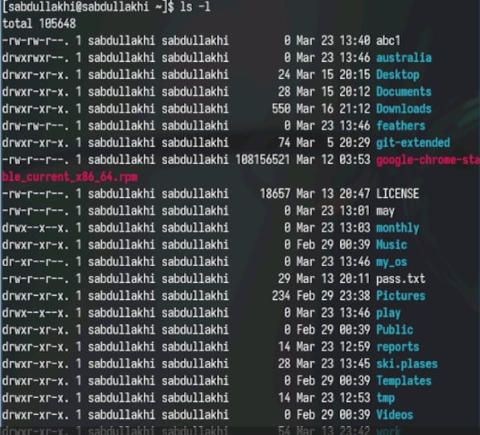{ #fig:012 width=70% }

## Просмотрение содержимое файла 

- cat : для Просмотрение содержимое файла 

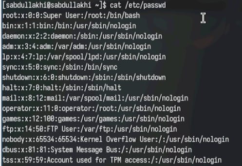{ #fig:013 width=70% }

##  Копирование файла 

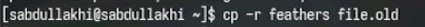{ #fig:014 width=70% }

##  Перемещение файл

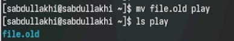{ #fig:015 width=70% }

## Копирование каталога

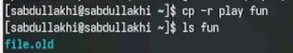{ #fig:016 width=70% }

## Перемещение и Название каталога 

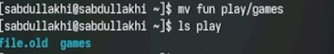{ #fig:017 width=70% }

## Работа с Правами файла

- chmod u-r - команда для лишения владельца файла права на чтение.
- chmod u+r - команда для присвоения владельцу файла права на чтение
- chmod u-x - команда для лишения владельца каталога права на
выполнение.
- chmod u+x - команда для присвоения владельцу каталога права на
выполнение

## Cодержамое

-  Работа с Правами файла

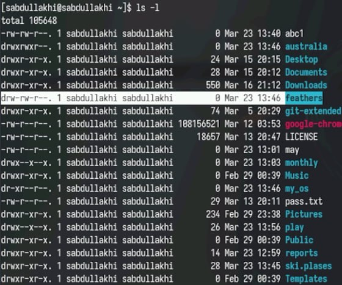{ #fig:025 width=70% }

## Посмотрим с помощью команды man mount

- Для просмотра используемых в операционной системе файловых систем используется команда mount
 
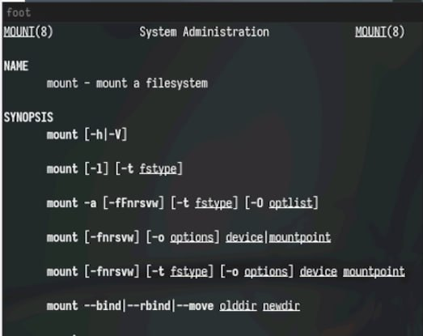{ #fig:026 width=70% }

## Посмотрим с помощью команды man fsck

- С помощью команды fsck можно проверить (а в ряде случаев восстановить) целостность файловой системы

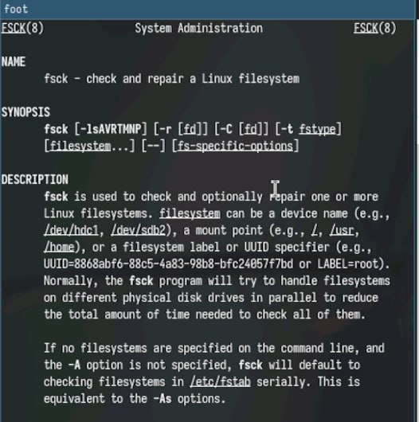{ #fig:027 width=70% }

## Посмотрим с помощью команды man mksf

- Утилита kill отправляет сигнал процессу(-ам), указанному с помощью каждого из операндов идентификатор_процесса.

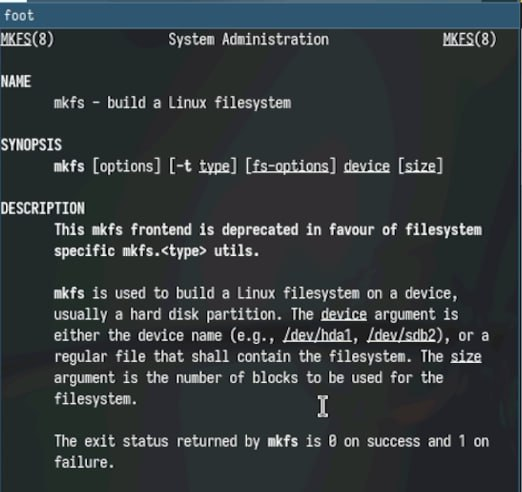{ #fig:028 width=70% }

## Посмотрим с помощью команды man kill

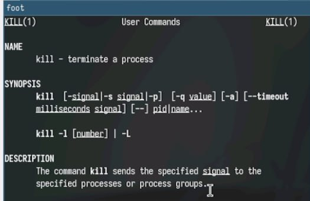{ #fig:029 width=70% }

## Вывод

В ходе лабораторной работы мы узнали о структуре файловой системы Linux, именах каталогов и содержимом. получил практический опыт управления процессами (и задачами), проверки использования диска, обслуживания файловой системы и использования команд для взаимодействия с файлами и каталогами.

##
Спасибо за внимание!
