---
## Front matter
title: "Шаблон отчёта по лабораторной работе №7"
subtitle: "Анализ файловой системы Linux"
author: "Абдуллахи Шугофа"

## Generic otions
lang: ru-RU
toc-title: "Содержание"

## Bibliography
bibliography: bib/cite.bib
csl: pandoc/csl/gost-r-7-0-5-2008-numeric.csl

## Pdf output format
toc: true # Table of contents
toc-depth: 2
lof: true # List of figures
lot: true # List of tables
fontsize: 12pt
linestretch: 1.5
papersize: a4
documentclass: scrreprt
## I18n polyglossia
polyglossia-lang:
  name: russian
  options:
	- spelling=modern
	- babelshorthands=true
polyglossia-otherlangs:
  name: english
## I18n babel
babel-lang: russian
babel-otherlangs: english
## Fonts
mainfont: PT Serif
romanfont: PT Serif
sansfont: PT Sans
monofont: PT Mono
mainfontoptions: Ligatures=TeX
romanfontoptions: Ligatures=TeX
sansfontoptions: Ligatures=TeX,Scale=MatchLowercase
monofontoptions: Scale=MatchLowercase,Scale=0.9
## Biblatex
biblatex: true
biblio-style: "gost-numeric"
biblatexoptions:
  - parentracker=true
  - backend=biber
  - hyperref=auto
  - language=auto
  - autolang=other*
  - citestyle=gost-numeric
## Pandoc-crossref LaTeX customization
figureTitle: "Рис."
tableTitle: "Таблица"
listingTitle: "Листинг"
lofTitle: "Список иллюстраций"
lotTitle: "Список таблиц"
lolTitle: "Листинги"
## Misc options
indent: true
header-includes:
  - \usepackage{indentfirst}
  - \usepackage{float} # keep figures where there are in the text
  - \floatplacement{figure}{H} # keep figures where there are in the text
---

# Цель работы

Ознакомление с файловой системой Linux, её структурой, именами и содержанием
каталогов. Приобретение практических навыков по применению команд для работы
с файлами и каталогами, по управлению процессами (и работами), по проверке исполь-
зования диска и обслуживанию файловой системы.

# Задание

1. Выполните все примеры, приведённые в первой части описания лабораторной работы.
2. Выполните следующие действия, зафиксировав в отчёте по лабораторной работе
используемые при этом команды и результаты их выполнения:
2.1. Скопируйте файл /usr/include/sys/io.h в домашний каталог и назовите его
equipment. Если файла io.h нет, то используйте любой другой файл в каталоге
/usr/include/sys/ вместо него.
2.2. В домашнем каталоге создайте директорию ~/ski.plases.
2.3. Переместите файл equipment в каталог ~/ski.plases.
2.4. Переименуйте файл ~/ski.plases/equipment в ~/ski.plases/equiplist.
2.5. Создайте в домашнем каталоге файл abc1 и скопируйте его в каталог
~/ski.plases, назовите его equiplist2.
2.6. Создайте каталог с именем equipment в каталоге ~/ski.plases.
2.7. Переместите файлы ~/ski.plases/equiplist и equiplist2 в каталог
~/ski.plases/equipment.
2.8. Создайте и переместите каталог ~/newdir в каталог ~/ski.plases и назовите
его plans.
3. Определите опции команды chmod, необходимые для того, чтобы присвоить перечис-
ленным ниже файлам выделенные права доступа, считая, что в начале таких прав
нет:
3.1. drwxr--r-- ... australia
3.2. drwx--x--x ... play
3.3. -r-xr--r-- ... my_os
3.4. -rw-rw-r-- ... feathers
При необходимости создайте нужные файлы.
4. Проделайте приведённые ниже упражнения, записывая в отчёт по лабораторной
работе используемые при этом команды:
4.1. Просмотрите содержимое файла /etc/password.
4.2. Скопируйте файл ~/feathers в файл ~/file.old.
4.3. Переместите файл ~/file.old в каталог ~/play.
4.4. Скопируйте каталог ~/play в каталог ~/fun.
4.5. Переместите каталог ~/fun в каталог ~/play и назовите его games.
4.6. Лишите владельца файла ~/feathers права на чтение.
4.7. Что произойдёт, если вы попытаетесь просмотреть файл ~/feathers командой
cat?
4.8. Что произойдёт, если вы попытаетесь скопировать файл ~/feathers?
4.9. Дайте владельцу файла ~/feathers право на чтение.
4.10. Лишите владельца каталога ~/play права на выполнение.
4.11. Перейдите в каталог ~/play. Что произошло?
4.12. Дайте владельцу каталога ~/play право на выполнение.
5. Прочитайте man по командам mount, fsck, mkfs, kill и кратко их охарактеризуйте,
приведя примеры.

# Выполнение лабораторной работы

2.1 Скопируйте файл /usr/include/sys/io.h в домашний каталог и назовите его
equipment. Если файла io.h нет, то используйте любой другой файл в каталоге
/usr/include/sys/ вместо него.

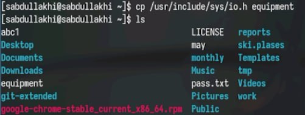{#fig:002 width=70%}

2.2. В домашнем каталоге создайте директорию ~/ski.plases.

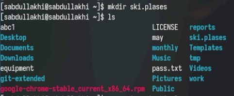{#fig:003 width=70%}

2.3. Переместите файл equipment в каталог ~/ski.plases.

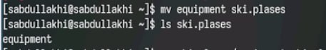{#fig:004 width=70%}

2.4. Переименуйте файл ~/ski.plases/equipment в ~/ski.plases/equiplist.

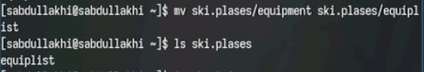{#fig:005 width=70%}

2.5. Создайте в домашнем каталоге файл abc1 и скопируйте его в каталог
~/ski.plases, назовите его equiplist2.

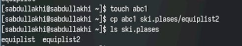{#fig:006 width=70%}

2.6. Создайте каталог с именем equipment в каталоге ~/ski.plases.

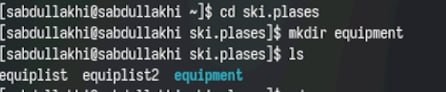{#fig:007 width=70%}

2.7. Переместите файлы ~/ski.plases/equiplist и equiplist2 в каталог
~/ski.plases/equipment.

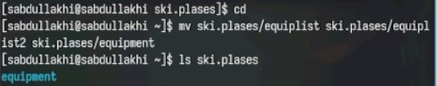{#fig:008 width=70%}

2.8. Создайте и переместите каталог ~/newdir в каталог ~/ski.plases и назовите
его plans.

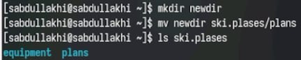{#fig:009 width=70%}

3. Определите опции команды chmod, необходимые для того, чтобы присвоить перечис-
ленным ниже файлам выделенные права доступа, считая, что в начале таких прав
нет:
3.1. drwxr--r-- ... australia
3.2. drwx--x--x ... play
3.3. -r-xr--r-- ... my_os
3.4. -rw-rw-r-- ... feathers
При необходимости создайте нужные файлы.

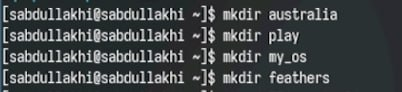{#fig:010 width=70%}

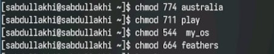{#fig:011 width=70%}

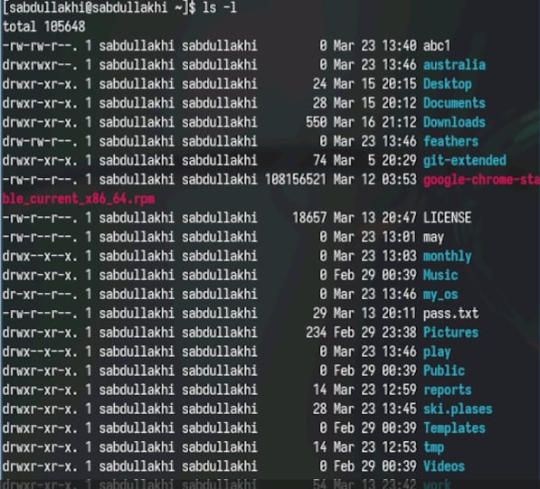{#fig:012 width=70%}

4.1. Просмотрите содержимое файла /etc/password.

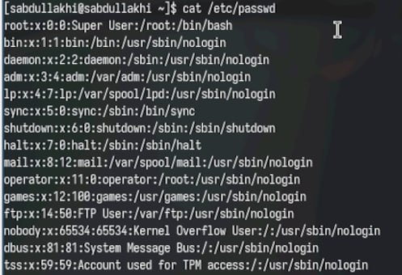{#fig:013 width=70%}

4.2. Скопируйте файл ~/feathers в файл ~/file.old.

{#fig:014 width=70%}

4.3. Переместите файл ~/file.old в каталог ~/play.

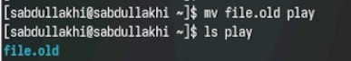{#fig:015 width=70%}

4.4. Скопируйте каталог ~/play в каталог ~/fun.

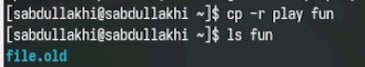{#fig:016 width=70%}

4.5. Переместите каталог ~/fun в каталог ~/play и назовите его games.

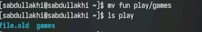{#fig:017 width=70%}

4.6. Лишите владельца файла ~/feathers права на чтение.

{#fig:018 width=70%}

4.7. Что произойдёт, если вы попытаетесь просмотреть файл ~/feathers командой
cat?

- доступ запрещён

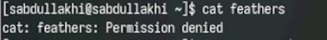{#fig:019 width=70%}

4.8. Что произойдёт, если вы попытаетесь скопировать файл ~/feathers?
 
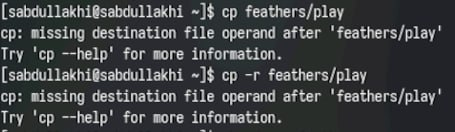{#fig:020 width=70%}

4.9. Дайте владельцу файла ~/feathers право на чтение.

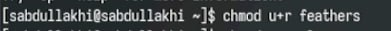{#fig:021 width=70%}

4.10. Лишите владельца каталога ~/play права на выполнение.

{#fig:022 width=70%}

4.11. Перейдите в каталог ~/play. Что произошло?

- Доступ запершён

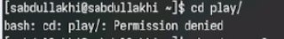{#fig:023 width=70%}

4.12. Дайте владельцу каталога ~/play право на выполнение.

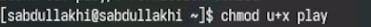{#fig:024 width=70%}

*Результат*

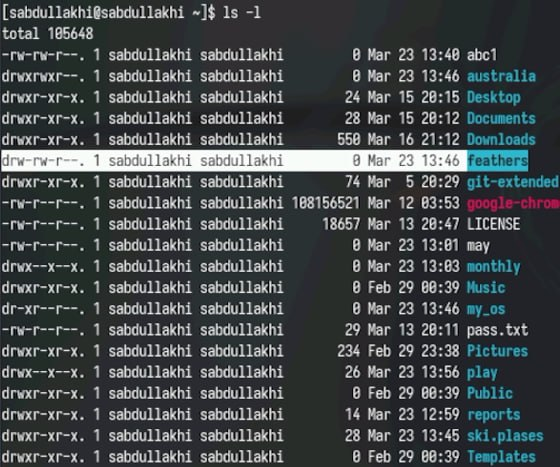{#fig:025width=70%}

5. Прочитайте man по командам mount, fsck, mkfs, kill и кратко их охарактеризуйте,
приведя примеры.

- Для просмотра используемых в операционной системе файловых систем используется команда mount

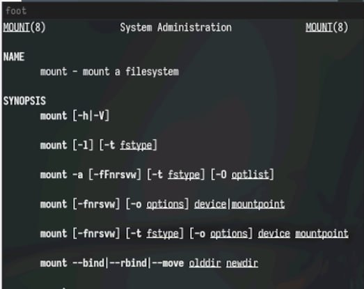{#fig:026 width=70%}

- С помощью команды fsck можно проверить (а в ряде случаев восстановить) целостность файловой системы

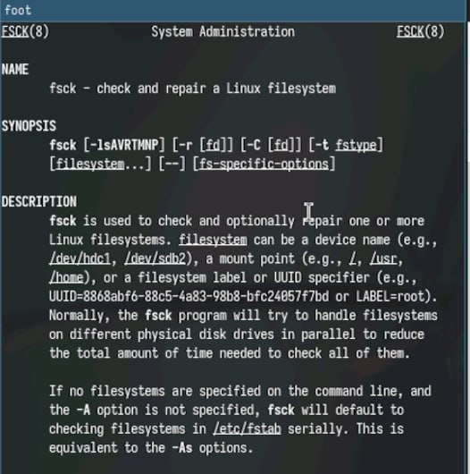{#fig:027 width=70%}

- mkfs используется для создания файловой системы Linux на некотором устройстве, обычно в разделе жёсткого диска. В качестве аргумента filesys для файловой системы может выступать или название устройства (например, /dev/hda1, /dev/sdb2) или точка монтирования
 
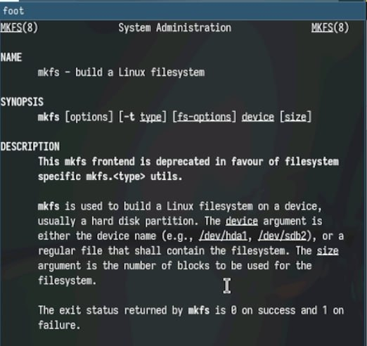{#fig:028 width=70%}

- Утилита kill отправляет сигнал процессу(-ам), указанному с помощью каждого из операндов идентификатор_процесса. По умолчанию утилита kill отправляет сигнал SIGTERM, но эту настройку по умолчанию можно переопределить путем определения имени сигнала для отправки

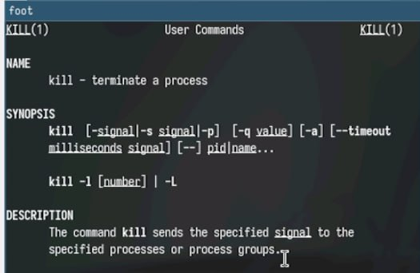{#fig:029 width=70%}

# Контрольные вопросы
1.  Дайте характеристику каждой файловой системе, существующей на жёстком диске компьютера, на котором вы выполняли лабораторную работу.
Ext2, Ext3, Ext4 или Extended Filesystem - это стандартная файловая система для Linux. Она была разработана еще для Minix. Она самая стабильная из всех существующих, кодовая база изменяется очень редко и эта файловая система содержит больше всего функций. Версия ext2 была разработана уже именно для Linux и получила много улучшений. В 2001 году вышла ext3, которая добавила еще больше стабильности благодаря использованию журналирования. В 2006 была выпущена версия ext4, которая используется во всех дистрибутивах Linux до сегодняшнего дня. В ней было внесено много улучшений, в том числе увеличен максимальный размер раздела до одного экзабайта.
JFS или Journaled File System была разработана в IBM для AIX UNIX и использовалась в качестве альтернативы для файловых систем ext. Сейчас она используется там, где необходима высокая стабильность и минимальное потребление ресурсов. При разработке файловой системы ставилась цель создать максимально эффективную файловую систему для многопроцессорных компьютеров. Также как и ext, это журналируемая файловая система, но в журнале хранятся только метаданные, что может привести к использованию старых версий файлов после сбоев.
ReiserFS - была разработана намного позже, в качестве альтернативы ext3 с улучшенной производительностью и расширенными возможностями. Она была разработана под руководством Ганса Райзера и поддерживает только Linux. Из особенностей можно отметить динамический размер блока, что позволяет упаковывать несколько небольших файлов в один блок, что предотвращает фрагментацию и улучшает работу с небольшими файлами. Еще одно преимущество - в возможности изменять размеры разделов на лету. Но минус в некоторой нестабильности и риске потери данных при отключении энергии. Раньше ReiserFS применялась по умолчанию в SUSE Linux, но сейчас разработчики перешли на Btrfs.
XFS - это высокопроизводительная файловая система, разработанная в Silicon Graphics для собственной операционной системы еще в 2001 году. Она изначально была рассчитана на файлы большого размера, и поддерживала диски до 2 Терабайт. Из преимуществ файловой системы можно отметить высокую скорость работы с большими файлами, отложенное выделение места, увеличение разделов на лету и незначительный размер служебной информации.
XFS - журналируемая файловая система, однако в отличие от ext, в журнал записываются только изменения метаданных. Она используется по умолчанию в дистрибутивах на основе Red Hat. Из недостатков - это невозможность уменьшения размера, сложность восстановления данных и риск потери файлов при записи, если будет неожиданное отключение питания, поскольку большинство данных находится в памяти.
Btrfs или B-Tree File System - это совершенно новая файловая система, которая сосредоточена на отказоустойчивости, легкости администрирования и восстановления данных. Файловая система объединяет в себе очень много новых интересных возможностей, таких как размещение на нескольких разделах, поддержка подтомов, изменение размера не лету, создание мгновенных снимков, а также высокая производительность. Но многими пользователями файловая система Btrfs считается нестабильной. Тем не менее, она уже используется как файловая система по умолчанию в OpenSUSE и SUSE Linux.
2.  Приведите общую структуру файловой системы и дайте характеристику каждой директории первого уровня этой структуры.
/ — root каталог. Содержит в себе всю иерархию системы;
/bin — здесь находятся двоичные исполняемые файлы. Основные общие команды, хранящиеся отдельно от других программ в системе (прим.: pwd, ls, cat, ps);
/boot — тут расположены файлы, используемые для загрузки системы (образ initrd, ядро vmlinuz);
/dev — в данной директории располагаются файлы устройств (драйверов). С помощью этих файлов можно взаимодействовать с устройствами. К примеру, если это жесткий диск, можно подключить его к файловой системе. В файл принтера же можно написать напрямую и отправить задание на печать;
/etc — в этой директории находятся файлы конфигураций программ. Эти файлы позволяют настраивать системы, сервисы, скрипты системных демонов;
/home — каталог, аналогичный каталогу Users в Windows. Содержит домашние каталоги учетных записей пользователей (кроме root). При создании нового пользователя здесь создается одноименный каталог с аналогичным именем и хранит личные файлы этого пользователя;
/lib — содержит системные библиотеки, с которыми работают программы и модули ядра;
/lost+found — содержит файлы, восстановленные после сбоя работы системы. Система проведет проверку после сбоя и найденные файлы можно будет посмотреть в данном каталоге;
/media — точка монтирования внешних носителей. Например, когда вы вставляете диск в дисковод, он будет автоматически смонтирован в директорию /media/cdrom;
/mnt — точка временного монтирования. Файловые системы подключаемых устройств обычно монтируются в этот каталог для временного использования;
/opt — тут расположены дополнительные (необязательные) приложения. Такие программы обычно не подчиняются принятой иерархии и хранят свои файлы в одном подкаталоге (бинарные, библиотеки, конфигурации);
/proc — содержит файлы, хранящие информацию о запущенных процессах и о состоянии ядра ОС;
/root — директория, которая содержит файлы и личные настройки суперпользователя;
/run — содержит файлы состояния приложений. Например, PID-файлы или UNIX-сокеты;
/sbin — аналогично /bin содержит бинарные файлы. Утилиты нужны для настройки и администрирования системы суперпользователем;
/srv — содержит файлы сервисов, предоставляемых сервером (прим. FTP или Apache HTTP);
/sys — содержит данные непосредственно о системе. Тут можно узнать информацию о ядре, драйверах и устройствах;
/tmp — содержит временные файлы. Данные файлы доступны всем пользователям на чтение и запись. Стоит отметить, что данный каталог очищается при перезагрузке;
/usr — содержит пользовательские приложения и утилиты второго уровня, используемые пользователями, а не системой. Содержимое доступно только для чтения (кроме root). Каталог имеет вторичную иерархию и похож на корневой;
/var — содержит переменные файлы. Имеет подкаталоги, отвечающие за отдельные переменные. Например, логи будут храниться в /var/log, кэш в /var/cache, очереди заданий в /var/spool/ и так далее.
3.  Какая операция должна быть выполнена, чтобы содержимое некоторой файловой системы было доступно операционной системе?
Монтирование тома.
4.  Назовите основные причины нарушения целостности файловой системы. Как устранить повреждения файловой системы?
Отсутствие синхронизации между образом файловой системы в памяти и ее данными на диске в случае аварийного останова может привести к появлению следующих ошибок:
-  Один блок адресуется несколькими mode (принадлежит нескольким файлам).
-  Блок помечен как свободный, но в то же время занят (на него ссылается onode).
-  Блок помечен как занятый, но в то же время свободен (ни один inode на него не ссылается).
-  Неправильное число ссылок в inode (недостаток или избыток ссылающихся записей в каталогах).
-  Несовпадение между размером файла и суммарным размером адресуемых inode блоков.
-  Недопустимые адресуемые блоки (например, расположенные за пределами файловой системы).
-  “Потерянные” файлы (правильные inode, на которые не ссылаются записи каталогов).
-  Недопустимые или неразмещенные номера inode в записях каталогов.
5.  Как создаётся файловая система?
mkfs - позволяет создать файловую систему Linux.
6.  Дайте характеристику командам для просмотра текстовых файлов.
Cat - выводит содержимое файла на стандартное устройство вывода
7.  Приведите основные возможности команды cp в Linux.
Cp – копирует или перемещает директорию, файлы.
8.  Приведите основные возможности команды mv в Linux.
Mv - переименовать или переместить файл или директорию
9.  Что такое права доступа? Как они могут быть изменены?
Права доступа к файлу или каталогу можно изменить, воспользовавшись командой chmod. Сделать это может владелец файла (или каталога) или пользователь с правами администратора.

# Выводы

В ходе лабораторной работы мы узнали о структуре файловой системы Linux, именах каталогов и содержимом. получил практический опыт управления процессами (и задачами), проверки использования диска, обслуживания файловой системы и использования команд для взаимодействия с файлами и каталогами.

