---
## Front matter
lang: ru-RU
title: Markdown

author:
  - Абдуллахи Шугофа
institute:
  - Российский университет дружбы народов, Москва, Россия
date: 2 март 2024

## i18n babel
babel-lang: russian
babel-otherlangs: english

## Fonts
mainfont: PT Serif
romanfont: PT Serif
sansfont: PT Sans
monofont: PT Mono
mainfontoptions: Ligatures=TeX
romanfontoptions: Ligatures=TeX
sansfontoptions: Ligatures=TeX,Scale=MatchLowercase
monofontoptions: Scale=MatchLowercase,Scale=0.9

## Formatting pdf
toc: false
toc-title: Содержание
slide_level: 2
aspectratio: 169
section-titles: true
theme: metropolis
header-includes:
 - \metroset{progressbar=frametitle,sectionpage=progressbar,numbering=fraction}
 - '\makeatletter'
 - '\beamer@ignorenonframefalse'
 - '\makeatother'
---

## Список добавляемых данных.
1.  Разместила фотографию владельца сайта.

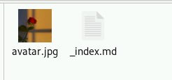{#fig:090 width=70%}

## Разместила краткое описание владельца сайта (Biography).

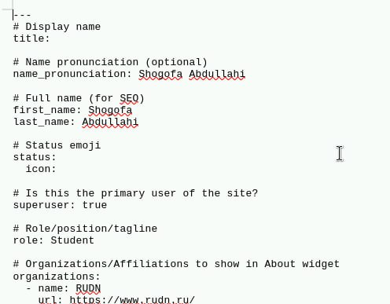{#fig:002 width=70%}

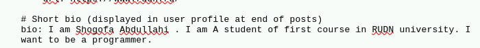{#fig:003 width=70%}

## Добавила информацию об интересах (Interests).

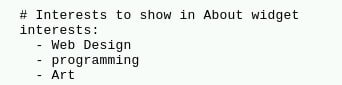{#fig:004 width=70%}

##  Добавила информацию от образовании (Education).

{#fig:005 width=70%}

## пуикт 1 готово

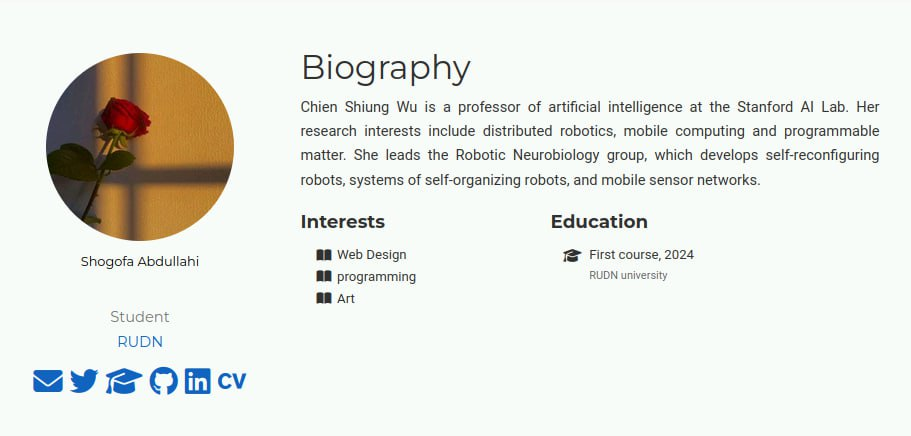{#fig:006 width=70%}

## 2. делать пост по прошедшей неделе.

- В этом раздиле я написала пост по прошедшей неделе
 
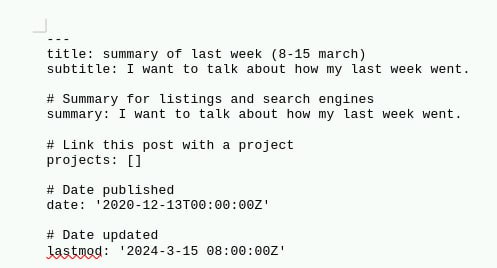{#fig:007 width=70%}

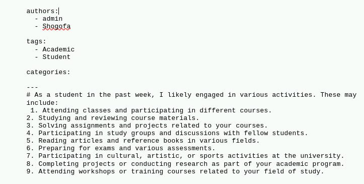{#fig:008 width=70%}

## пост по прошедшей неделе.

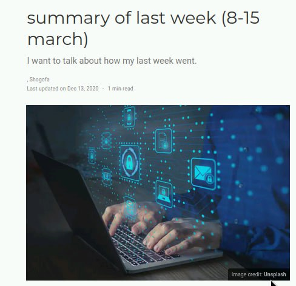{#fig:009 width=70%}

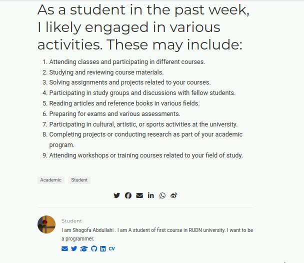{#fig:010 width=70%}

## 3. Добавить пост на тему по выбору:

- я выбрала делать пось о CI/CD
       - Непрерывная интеграция и непрерывное развертывание (CI/CD).

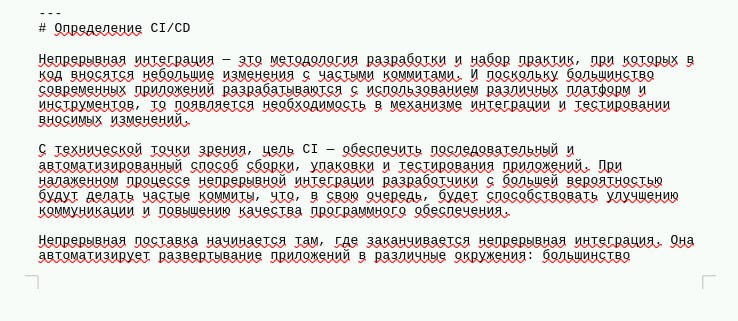{#fig:011 width=50%}

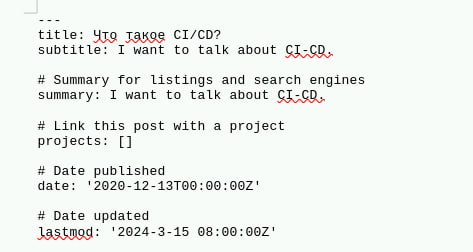{#fig:012 width=50%}

## пост от CI/CD 

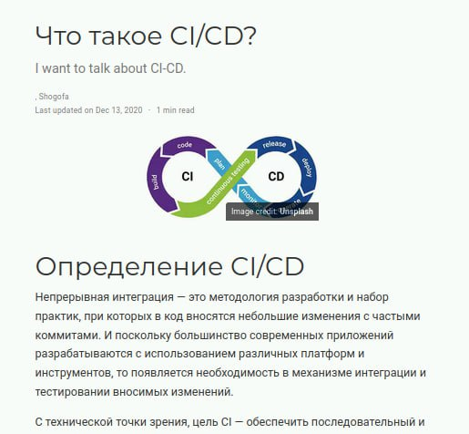{#fig:013 width=70%}

## пост

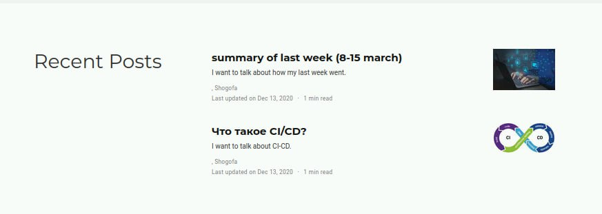{#fig:014 width=70%}

## 
Спасибо за внимание!
